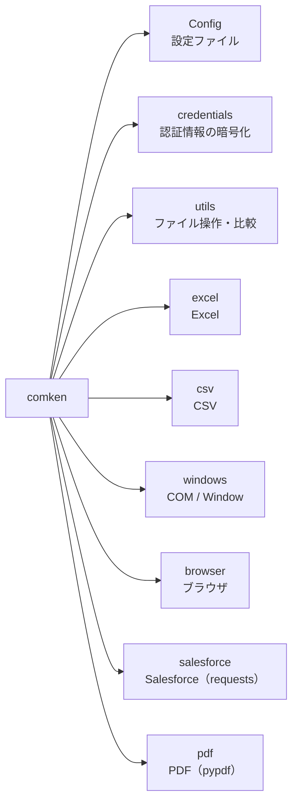
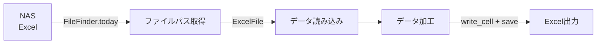

# original_libs

業務自動化で使う Python 共通ライブラリ。

## はじめて使う人へ

この README を最初から最後まで読む必要はない。次の順で進めるのが早い:

1. **プロジェクトの準備**（下の「プロジェクトの準備」節。起動用バッチに共有ライブラリの場所を設定）
2. **やりたいことを「モジュール一覧」から探す** → その節のコード例をコピーして動かす
3. **動くサンプルを見る** → `examples/`（一覧は examples/README.md。CSV→Excel レポート・
   突合転記・差分レポートはインストール直後にそのまま動かせる。新規ツールの雛形もここ）
4. **エラーが出たら** → ERRORS.md（メッセージに対処法が書いてある）

最初の1本はこれだけで書ける（CSV を読んで Excel レポートを作る例）:

```python
from comken.csv import CsvReader
from comken.excel import ExcelFile

rows = CsvReader(r"C:\作業\data.csv").rows()      # CSV を読む（1行 = 1辞書）

with ExcelFile.create(r"C:\作業\report.xlsx") as f:  # 新規 Excel を作る
    s = f.sheet("Sheet1")
    s.write_table(rows)                            # ヘッダー + データをまとめて書く
    s.auto_width()                                 # 列幅を整える
    s.freeze_header()                              # 1行目を固定
    f.save()
```

**関連ドキュメント**:

- 設計方針・ユースケース: 仕様書.md（管理者・設計を知りたい人向け）
- コーディング規約（共通）: CONVENTIONS.md（すべての Python コード）
  - comken 本体を編集する人: docs/ライブラリ開発規約.md
  - comken を使うプロジェクトを作る人: docs/プロジェクト規約.md
- エラーが出たときの対応: ERRORS.md（プロジェクトに配る雛形）
- 用途別の関数一覧（何が用意されているか）: docs/機能カタログ.md
- コードレビュー・読解する人向け: docs/コードリーディングガイド.md（全体地図と読む順番）
- 検討中の設計メモ: docs/Salesforce認証パターン.md、docs/認証情報の公開鍵配布.md

## モジュール一覧

| モジュール | 概要 |
|---|---|
| Config | INI ファイルの読み込み |
| Logger | ロガーの初期化（日別ファイル + コンソール） |
| 認証情報（credentials） | パスワード等の暗号化保存（Windows DPAPI） |
| CSV | CSV の読み込み・検索・抽出 |
| Excel（openpyxl） | Excel の読み書き（数式・マクロは自動で win32com を使用） |
| Windows（pywin32） | Excel COM 操作・ウィンドウ操作・レジストリ読み取り |
| Browser（Edge） | Edge ブラウザ操作 |
| Salesforce | CRUD・SOQL・レポート・Bulk（salesforce。requests 使用） |
| PDF | PDF の結合・分割・テキスト抽出（pypdf。導入できない環境では使わない） |
| utils | ファイル操作・データ比較・テキスト正規化・待機・リトライ・時間計測・zip・特殊フォルダ取得 |

## 定数クラス一覧

選択肢を渡す引数には生の文字列ではなく、これらの定数を使う。

| 定数クラス | import | 用途 | 例 |
|---|---|---|---|
| `Color` | `from comken.excel import Color` | セルの背景色 | `set_fill(color=Color.RED)` |
| `SortBy` | `from comken.utils import SortBy` | FileFinder.latest の並び順 | `latest(by=SortBy.UPDATED)` |
| `Encoding` | `from comken.csv import Encoding` | CSV の文字コード | `CsvReader(path, encoding=Encoding.CP932)` |

---

## 機能の追加・変更の要望

「このエンコーディングを `Encoding` に追加してほしい」「この色を `Color` に追加してほしい」など、
**複数のプロジェクトで使えそうな機能は管理者に連絡してください。**

要望の例:

| 種類 | 例 |
|---|---|
| 定数クラスへの値の追加 | `Encoding` に新しい文字コード、`Color` に色を追加したい |
| デフォルト値の変更 | `BrowserOptions` のデフォルトを変えたい |
| ユーティリティの追加 | よく使うファイル操作・文字列変換などを共通化したい |
| 新モジュール | 複数プロジェクトで同じような処理を書いている |

個人プロジェクト固有の処理は各プロジェクト側に書く。
**複数のプロジェクトで繰り返し書いている処理**が追加候補です。

---

## プロジェクトの準備

comken は共有サーバー上の1か所を**直接参照する**（ローカルへのコピー・同期はしない）。
各プロジェクトのルートに `templates/実行.bat` をコピーし、先頭の `COMKEN_ROOT` を
共有サーバー上の comken リポジトリルートに合わせる。バッチは実行中だけ `PYTHONPATH` を設定するため、
PC の環境変数を変更しない。

```bat
set "COMKEN_ROOT=\\server\share\tools\comken"
set "PYTHONPATH=%COMKEN_ROOT%;%PYTHONPATH%"
python main.py
```

以後、どのプロジェクトからでも `import comken` が共有サーバーの最新版を読む。更新のたびの配布作業はない。
（共有サーバーの comken を更新すれば、次に import した全プロジェクトが最新になる）

- **バイトコードキャッシュは自動でローカルに逃がす**: 共有サーバーが読み取り専用でも
  遅くならないよう、comken は import 時に `.pyc` の出力先を `%LOCALAPPDATA%\comken-pycache`
  に向ける（`sys.pycache_prefix`）。環境変数 `PYTHONPYCACHEPREFIX` を設定済みの場合はそちらを尊重する。
- **代償**: import のたびにネットワークを読むので起動が遅く、共有サーバーが落ちると動かない。
  詳しい仕組み・運用（更新/ロールバック/開発との分離）は 仕様書.md の「参照・運用」を参照。

> 旧方式（robocopy でローカル同期する `初回セットアップ.bat` / `実行.bat` / `リリース.bat`）は
> 直接参照への移行で不要になったため削除済み。
> `templates/認証情報の登録.bat` は、ダブルクリックで認証情報の登録 GUI を開くためのもの
> （各プロジェクトのルートにコピーして使う。非エンジニア向け）。

---

## 実行モード（バージョン / デバッグ / dry-run）

```python
import comken

comken.__version__        # → "0.2.0"

# デバッグモード: ライブラリ主要処理（Excel 読み込み・転記・保存、CSV 読み書き、zip 等）の
# 所要時間が DEBUG ログ（日別ログファイル）に残る。どこが遅いかの調査に使う
comken.set_debug(True)

# dry-run モード: 外部に影響する操作を実行せず、内容だけ [DRY-RUN] 付きで INFO ログに出す。
# 対象: ファイル移動・コピー、Excel/CSV の保存、Salesforce の書き込み。
# 読み取り（CSV・Excel の読み込み、SOQL クエリ）は通常どおり実行される
comken.set_dry_run(True)
```

自作関数の処理時間も同じ仕組みで計測できる（デバッグモード中だけログに出る）:

```python
from comken.utils import measure

@measure
def build_report():
    ...
```

---

## Config

`config.ini` を `config.SECTION.KEY` の形式で読み込む。

**基本の使い方**（`src/config.py` は不要。エディタ補完も効く）:

```python
from comken import config

# 初回アクセス時にカレントディレクトリの config.ini を1度だけ読む（遅延読み込み）
folder = config.REPORT.OUTPUT_FOLDER
path = config.FILES.INPUT_FOLDER / "東日本.csv"

# config.ini が別の場所にある場合は、最初に使う前に読む場所を指定する
config.read(r"C:\作業\config.ini")
```

> **補完（Pylance）:** config を初めて読むと、config.ini から補完用スタブ
> `typings/comken/`（config.pyi + __init__.pyi）が自動生成される。VS Code + Pylance で
> `config.SECTION.KEY` が型付き補完される（typings/ は .gitignore 推奨）。
> ツール実行前にスタブだけ先に作りたいときは `python -m comken.config`。

明示的にインスタンスを持ちたい場合（テストや複数 ini の読み分けに）:

```python
from comken.config import Config

config = Config()                      # カレントディレクトリの config.ini
config = Config("path/to/config.ini")  # パスを指定する場合
```

```ini
; config.ini（プロジェクト固有の非機密設定を書く）
; パスワード等の機密情報は書かない → 認証情報（credentials）を使う
; セクション名・キー名は大文字で書く（固定値と分かる + Python 側と表記が一致する）
[CREDENTIALS]
SALESFORCE = salesforce

[REPORT]
OUTPUT_FOLDER = C:\作業\reports
TEMPLATE_PATH = \\nas-server\templates\template.xlsx
```

```python
config.CREDENTIALS.SALESFORCE # → str
config.REPORT.OUTPUT_FOLDER # → str
config.REPORT.TEMPLATE_PATH # → str
```

**値の型変換ルール:**

| config.ini の値 | 返る型 |
|---|---|
| `true` / `false`（大文字小文字問わず） | bool に自動変換 |
| `yes` / `no` / `on` / `off` | **変換しない**（str のまま） |
| `[a, b, c]` | list[str] に自動変換 |
| 整数（`10` など） | int に自動変換 |
| 小数（`1.5` など） | float に自動変換 |
| 絶対パス（`C:\...` / `\\...` / `/...`） | Path に自動変換 |
| その他の文字列 | str のまま |

`true` / `false` 以外の `yes` / `on` / `1` / `0` を bool に変換しないのは、
`1` が「数値の1」なのか「ON の意味」なのか曖昧になる事故を避けるため。
数値を文字列として使いたい場合（シート名 `"2024"` など）はコード側で `str()` に変換する。

**リスト値は `[...]` で囲んで書く**（カンマ区切り。改行区切りも可）:

```ini
[REPORT]
TARGET_SHEETS = [東日本, 西日本, 集計]
ONE_SHEET = [東日本]
```

```python
config.REPORT.TARGET_SHEETS   # → ["東日本", "西日本", "集計"]
config.REPORT.ONE_SHEET       # → ["東日本"]（1要素でもリスト）
```

`[...]` で囲むのは「1要素のリスト」と「ただの文字列」を区別するため
（カンマの有無だけで判定すると、リストを1件に減らした途端に文字列になり、
for ループが文字単位になる事故が起きる）。

**エディタの補完候補（型スタブの自動生成）:**

属性は実行時に動的に作られるため、そのままではエディタが `config.REPORT.` の先を補完できない。
そのため config を初めて読むと、config.ini から補完用スタブ `typings/comken/`
（config.pyi + `__init__.pyi`）が自動生成される。VS Code + Pylance がこれを読み、
セクション・キーが型付きで補完される（config.ini を変更すると次の実行で更新される）。

まだ一度も実行していない状態で先にスタブだけ作りたい場合は手動で生成できる:

```
python -m comken.config
```

生成された `typings/` は手で編集せず、`.gitignore` に含める（自動生成物）。

なお**ブラウザの設定は config.ini には書かない**。`BrowserOptions` のインスタンス
（`src/browser_options.py`）で行う（Browser を参照）。

---

## Logger

main.py で1回だけ呼ぶ。以降サブモジュールは `logging.getLogger(__name__)` でそのまま出力される。

- `logs/main_YYYYMMDD.log` に DEBUG 以上を出力（日別ファイル）
- コンソールには INFO 以上を出力
- 2回呼んでもハンドラは重複しない

```python
# main.py
from comken import setup_logger

logger = setup_logger("main")
logger.info("処理開始")

# ログの出力先フォルダを変えたい場合は log_dir で指定する（なければ作成される）
# ※ 出力先はローカルにする。NAS はモジュールの置き場・読み込み元であり、ログ等の新規出力先にはしない
logger = setup_logger("main", log_dir=r"C:\logs\my_project")
```

```python
# src/ 以下のモジュール
import logging

logger = logging.getLogger(__name__)
logger.info("CSV読み込み完了: %d件", len(rows))
```

---

## 認証情報（credentials）

パスワード・トークン・ユーザー名などの機密情報・個人情報を Windows DPAPI で暗号化して保存する。
config.ini には機密情報を書かず、このモジュールを使う。

**仕組み:**

- 保存先は `%USERPROFILE%\.comken\credentials.dat`（プロジェクト内には置かない）
- Windows がログオン中のアカウントに紐付けて暗号化する。鍵の管理は不要
- 同じ「ユーザー × PC」でないと復号できない。ファイルをコピーされても読まれない
- 逆に言うと、**実行する PC ごとに登録が必要**（別の PC やサーバーで実行する場合はそこでも登録する）
- 1ユーザーにつき1ファイルで、キー名1つに値1つを何件でも登録できる
- 「ユーザー名とパスワードが必ずセット」という決め打ちはしない。パスワードだけのシステムにも対応できる

### 登録・削除（GUI）

ターミナル操作が不要な GUI 版。登録済みキーの一覧・登録フォーム・削除ボタンが1画面に揃っている。
値はマスク表示（●●●）され、「値を表示する」チェックで確認できる。

```
> python -m comken.credentials --gui
```

bat ファイルにしておくとダブルクリックで起動できる:

```bat
@echo off
python -m comken.credentials --gui
```

- 登録済みキーをダブルクリックするとフォームに読み込まれる（上書き用。値は空のまま）
- プロジェクトのフォルダで起動すると、コード内の REQUIRED_CREDENTIALS 宣言のうち
  未登録の項目が一覧表示される。ダブルクリックでフォームに入力される

### 登録・削除（対話式ツール）

GUI が使えない環境（リモートのターミナル等）向け。起動してメニューを選ぶだけ。

```
> python -m comken.credentials
=== comken 認証情報の管理 ===

登録済みのキー名:
  oju_sys_password

1: 登録（新規追加・上書き）
2: 削除
q: 終了
選択: 1

システム名（例: salesforce）: salesforce
salesforce は新しいシステム名です。この名前で登録しますか？（y で続行）: y
項目名（例: username / password / token。空 Enter で終了）: username
値（入力しても画面には表示されません）:
値（確認のためもう一度）:
保存しました: salesforce_username
項目名（例: username / password / token。空 Enter で終了）: password
値（入力しても画面には表示されません）:
値（確認のためもう一度）:
保存しました: salesforce_password
項目名（例: username / password / token。空 Enter で終了）: ← 空 Enter で終了
保存先: C:\Users\xxx\.comken\credentials.dat
```

- **システム名は1回だけ入力**し、項目（username / password / token…）を続けて登録できる。
  項目ごとにシステム名を打ち直さないので「password のときだけスペルミス」が起きない
- 新しいシステム名のときは確認が入る（既存システムに追加するつもりのタイプミスに気づける）
- 既存のシステム名なら登録済みの項目一覧が表示される
- 同じキー名なら「上書き（＝変更）」になる。パスワードを変えたいときも同じ名前で登録し直せばよい
- 値は打ち間違い防止のため2回入力する（画面には表示されない）

### コードからの利用

まとめて使う場合は `Credentials` にプレフィックスを渡して属性で取り出す（キー名の直書きを避けられる）。

```python
from comken.credentials import Credentials

sf = Credentials("salesforce")
sf.username # → salesforce_username の値
sf.password # → salesforce_password の値
```

1件だけなら `load_credential` を使う。

```python
from comken.credentials import load_credential

password = load_credential("oju_sys_password")
```

未登録のキー名を指定すると `CredentialNotFoundError` になる（登録コマンドを案内するメッセージ付き）。

### キー名の付け方

| ルール | 例 |
|---|---|
| `システム名_項目名` の形式にする | `salesforce_password`, `oju_sys_password` |
| アカウントを使い分けるときはシステム名に用途を含める | `salesforce_test_password` |

キー名に使えるのは**半角英数字とアンダースコアのみ**。
それ以外（漢字・スペース・記号）は `InvalidCredentialNameError` で弾かれる。

どのシステム名（プレフィックス）を使うかはプロジェクトの config.ini の `[CREDENTIALS]` セクションに書く（キー名は機密ではない）:

```ini
[CREDENTIALS]
SALESFORCE = salesforce
```

```python
sf = Credentials(config.CREDENTIALS.SALESFORCE)
sf.username, sf.password, sf.token
# SALESFORCE = salesforce_test に変えるだけで全項目がテスト用に切り替わる
```

### 必要な項目の宣言（まとめて登録）

プロジェクトのコード側で「使う認証情報」を宣言しておくと、
CLI をプロジェクトのフォルダで起動したときに「3: まとめて登録」メニューが出る。

```python
# src/credentials.py（プロジェクト側で宣言する）
REQUIRED_CREDENTIALS = {
    "SALESFORCE": ["username", "password", "token"],  # キーは config.ini [CREDENTIALS] のキー名
    "OJU_SYS": ["password"],
}
```

```
選択: 3

このプロジェクトが使う認証情報（コード内の REQUIRED_CREDENTIALS 宣言）:
  oju_sys_password: 登録済み
  salesforce_password: 未登録
  salesforce_token: 未登録
  salesforce_username: 未登録

未登録の 3 件を順番に登録します（中断は Ctrl+C）。

--- salesforce_username ---
値（入力しても画面には表示されません）:
値（確認のためもう一度）:
保存しました: salesforce_username
...
```

- **キー名を1文字も打たずに登録できる**ので、スペルミスの余地がない
- プレフィックスは config.ini の `[CREDENTIALS]` から解決される
  （`SALESFORCE = salesforce_test` にすると要求されるキーもテスト用に変わる）
- 宣言はコードの一部としてエンジニアが管理する。宣言にない項目もメニュー1で自由に登録できる
- CLI は宣言を AST で読み取るだけで、プロジェクトのコードを実行しない

---

## CSV

```python
from comken.csv.handler import CsvReader

ORDER_ID = "A001"
STAFF_NAME = "山田"

reader = CsvReader("data.csv")
# 文字コードは自動判定（UTF-8 → CP932 の順に試す）。明示する場合:
# from comken.csv import Encoding
# CsvReader("data.csv", encoding=Encoding.CP932)
```

data.csv の中身が以下だとする。

```
注文番号,金額,担当者
A001,1000,山田
A002,2000,山田
A003,3000,佐藤
```

```python
# 全行取得（1行 = 1辞書。キーはヘッダー名、値はすべて str）
rows = reader.rows()
# → [{"注文番号": "A001", "金額": "1000", "担当者": "山田"},
#    {"注文番号": "A002", "金額": "2000", "担当者": "山田"},
#    {"注文番号": "A003", "金額": "3000", "担当者": "佐藤"}]

# 特定列のみ取得（指定した列だけの辞書になる）
rows = reader.rows(columns=["注文番号", "金額"])
# → [{"注文番号": "A001", "金額": "1000"},
#    {"注文番号": "A002", "金額": "2000"},
#    {"注文番号": "A003", "金額": "3000"}]

# キーで1件検索（最初に一致した1行。見つからなければ None）
row = reader.find("注文番号", ORDER_ID)
# → {"注文番号": "A001", "金額": "1000", "担当者": "山田"}

# キーで複数行検索（一致した全行。一致なしなら空リスト []）
rows = reader.filter("担当者", STAFF_NAME)
# → [{"注文番号": "A001", ...}, {"注文番号": "A002", ...}]

# 列の値一覧（ヘッダー行は含まない）
amounts = reader.column("金額")
# → ["1000", "2000", "3000"]

# キー列でインデックス化（突合用。キーで行を直接引ける）
lookup = reader.index("注文番号")
# → {"A001": {"注文番号": "A001", "金額": "1000", "担当者": "山田"},
#    "A002": {"注文番号": "A002", "金額": "2000", "担当者": "山田"},
#    "A003": {"注文番号": "A003", "金額": "3000", "担当者": "佐藤"}}
```

**ヘッダー行がない CSV** は `headers` で列名を付ける（1行目からデータとして読まれる）。

```python
# 中身: "A001,1000\nA002,2000\n" （ヘッダーなし）
reader = CsvReader("no_header.csv", headers=["注文番号", "金額"])
reader.rows()
# → [{"注文番号": "A001", "金額": "1000"}, {"注文番号": "A002", "金額": "2000"}]
```

### CSV の書き込み（CsvWriter）

```python
from comken.csv import CsvWriter

rows = [{"注文番号": "A001", "金額": "1000"}, {"注文番号": "A002", "金額": "2000"}]

# 新規作成（上書き）。親フォルダがなければ自動作成される
writer = CsvWriter("output.csv", fieldnames=["注文番号", "金額"])
writer.write_rows(rows)

# 既存ファイルの末尾に追記（ファイルがなければヘッダー付きで新規作成）
writer.append_row({"注文番号": "A003", "金額": "3000"})
writer.append_rows(rows)

# 文字コードはデフォルト UTF8_SIG（Excel でそのまま開ける）。Shift-JIS が必要なら:
writer = CsvWriter("output.csv", fieldnames=["注文番号"], encoding=Encoding.CP932)
# ※ Encoding.AUTO（読み込み時の自動判定用）を渡した場合は UTF8_SIG として書き込まれる
```

---

## ファイル名・ファイル取得ユーティリティ

### ファイルの移動・コピー（move_file / copy_file）

shutil を知らなくても使えるラッパー。ルールは共通で
「**dst が既存フォルダならその中へ、それ以外はファイルパス扱い（親フォルダ自動作成）、同名は上書き**」。

```python
from comken.utils import copy_file, move_file

move_file("report.xlsx", r"C:\作業\output")            # フォルダの中へ移動
move_file("report.xlsx", r"C:\作業\output\売上.xlsx")   # 名前を変えて移動（out フォルダがなければ作られる）
copy_file("report.xlsx", r"C:\作業\backup")             # コピー（元ファイルは残る。更新日時も保持）
# 返り値は移動・コピー後の Path
```

### ファイル名の組み立て・検索

```python
from comken.utils import FileFinder, FileNameBuilder

FOLDER = r"\\nas-server\share"

# 今日の日付付きファイル名を組み立てる
FileNameBuilder("売上レポート").plain()                # → "売上レポート.xlsx"
FileNameBuilder("売上レポート").prefix()               # → "20260711_売上レポート.xlsx"
FileNameBuilder("売上レポート").suffix()               # → "売上レポート_20260711.xlsx"
FileNameBuilder("ログ", ext=".csv").prefix()           # → "20260711_ログ.csv"
FileNameBuilder("月次レポート").prefix(date_format="%Y%m") # → "202607_月次レポート.xlsx"

# 今日の日付を含むファイルを取得（見つからなければ FileNotFoundError）
path = FileFinder(FOLDER).today()                      # YYYYMMDD で探す
path = FileFinder(FOLDER).today(date_format="%Y%m")    # YYYYMM で探す

# フォルダ内で最新のファイルを取得（見つからなければ FileNotFoundError）
# デフォルトは「ファイル名の辞書順で最後」= 日付プレフィックス命名なら名前上の最新。
# コピーや再保存で更新日時が変わっていても影響を受けない
from comken.utils import SortBy

path = FileFinder(FOLDER).latest()
path = FileFinder(FOLDER).latest(pattern="*.csv")        # CSV に絞る場合
path = FileFinder(FOLDER).latest(by=SortBy.UPDATED)      # 更新日時で選びたい場合

# 見つからなくても処理を続けたい場合は required=False（None が返る）
path = FileFinder(FOLDER).today(required=False)
if path is None:
    ...  # スキップ処理など
```

### データ比較（diff_row / diff_rows）

CSV・Excel から読んだ行（辞書）同士の差分を取る。for ループを自分で書かなくてよい。
**CSV の文字列と Excel の数値は同一視される**（`"1000"` と `1000` は差分にならない。
空セルの `None` と `""` も同じ扱い）ので、CSV ↔ Excel をまたいだ比較にそのまま使える。

```python
from comken.utils import diff_row, diff_rows

# 1行同士の差分（値が違う列だけ返る）
before = {"注文番号": "A001", "金額": "1000", "担当者": "山田"}
after = {"注文番号": "A001", "金額": 2000, "担当者": "山田"}

diff_row(before, after)
# → {"金額": ("1000", 2000)}
# 差分がなければ {} が返るので、if diff_row(a, b): で「変更あり」を判定できる

# データセット同士の差分（キー列で突合）
before = CsvReader("昨日.csv").rows()
with ExcelFile("今日.xlsx") as f:
    after = f.read_rows_as_dicts("Sheet1")

result = diff_rows(before, after, key="社員番号")
result.added    # → after にだけある行のリスト
result.removed  # → before にだけある行のリスト
result.changed  # → 値が変わった行のリスト（RowChange）

for change in result.changed:
    print(change.key)      # → "001"（キー列の値）
    print(change.columns)  # → {"氏名": ("山田", "山田太郎")}（変わった列だけ）
    print(change.before)   # → 変更前の行全体
    print(change.after)    # → 変更後の行全体
```

### よく使うフォルダ（Paths）

`Path(__file__).parent / ".." / "Downloads"` のような組み立てをしなくてよい。
Desktop / Downloads は **OneDrive の「既知のフォルダーの移動」にも追従する**
（レジストリから実際の場所を取得するため、`C:\Users\xxx\OneDrive\Desktop` に
リダイレクトされている環境でも正しいパスが返る）。

```python
from comken.utils import Paths

Paths.downloads()   # → C:\Users\xxx\Downloads
Paths.desktop()     # → C:\Users\xxx\OneDrive\Desktop（リダイレクトされている場合）
Paths.temp_dir()    # → C:\Users\xxx\AppData\Local\Temp
```

### 待機（wait）

`time.sleep` の代わりに単位を明示して書ける。「条件が満たされるまで待つ」もループを書かずに済む。

```python
from comken.utils import wait

wait.seconds(3)     # 3秒待つ
wait.seconds(0.5)   # 0.5秒待つ
wait.minutes(1)     # 1分待つ

# 条件が True になるまで待つ（デフォルト: 最大60秒・1秒間隔）
ok = wait.until(lambda: Path(r"C:\作業\result.xlsx").exists())
if not ok:
    raise TimeoutError("ファイルが生成されませんでした")

# タイムアウト・間隔を変える場合
ok = wait.until(lambda: 条件, timeout=120, interval=2)
```

### テキスト正規化（normalize / strip_spaces / remove_spaces)

業務データによくある表記揺れ（全角英数・半角カナ・全角スペース）を揃える。
突合キーの正規化に使うと「見た目は同じなのに一致しない」問題を防げる。

```python
from comken.utils import normalize, remove_spaces, strip_spaces

normalize("ＡＢＣ１２３")          # → "ABC123"（全角英数 → 半角）
normalize("ｱｲｳ")                  # → "アイウ"（半角カナ → 全角）
normalize("（株）")                # → "(株)"（全角記号 → 半角）

strip_spaces("　山田　太郎　")     # → "山田　太郎"（前後のみ除去。全角スペースも対象）
remove_spaces("０３－１２３４　５６７８")  # → "０３－１２３４５６７８"（全部除去）

# 突合前にキーを正規化する例
lookup = {normalize(k): v for k, v in lookup.items()}
row = lookup.get(normalize(key))
```

### リトライ（retry）

一時的な失敗（クリックが要素に遮られた、ネットワークが一瞬切れた等）を自動でやり直す。

```python
from comken.utils import retry

@retry()                     # 3回まで試す（間隔1秒）。全部失敗なら最後の例外が出る
def download_report():
    ...

# 対象の例外を絞る（それ以外は即座にエラー）
from selenium.common.exceptions import ElementClickInterceptedException

@retry(times=5, wait=2, on=(ElementClickInterceptedException,))
def click_submit():
    page.click(page.SUBMIT_BTN)
```

### 処理時間の計測（Timer）

「どこが遅いのか」を調べる。結果は INFO ログに出る。

```python
from comken.utils import Timer

with Timer("CSV読み込み"):
    rows = CsvReader("data.csv").rows()
# ログ: CSV読み込み: 3.21秒

@Timer("売上集計")            # デコレータでも使える
def aggregate():
    ...

t = Timer("転記処理")
with t:
    ...
print(t.elapsed)              # 経過秒数を値として使える
```

### zip 圧縮・展開（zip_folder / zip_files / unzip）

Windows のエクスプローラーで作られた zip（日本語ファイル名）も文字化けせず展開できる。

```python
from comken.utils import unzip, zip_files, zip_folder

zip_folder(r"C:\作業\reports")                       # → C:\作業\reports.zip
zip_files(["a.xlsx", "b.csv"], r"C:\作業\提出用.zip")
unzip(r"C:\作業\data.zip")                           # → C:\作業\data\ に展開
```

---

## ネットワーク・NAS ファイルの読み込み

NAS やネットワークドライブ上のファイルは直接開くと遅い・不安定になる場合がある。

### ExcelFile（openpyxl）

`local_copy_threshold_mb` を超えるファイルは自動でローカルにコピーしてから開く。
`with` ブロックを抜けるとテンポラリファイルは自動削除される。

```python
from comken.excel.handler import ExcelFile

NAS_PATH = r"\\nas-server\share\data.xlsx"
SHEET = "Sheet1"

# 10MB 以上は自動でローカルコピー（デフォルト）
with ExcelFile(NAS_PATH) as f:
    rows = f.read_rows_as_dicts(SHEET)

# 閾値を変える（50MB 以上でコピー）
with ExcelFile(NAS_PATH, local_copy_threshold_mb=50) as f:
    rows = f.read_rows_as_dicts(SHEET)

# ローカルコピーを無効化（社内ルールで不可の場合）
with ExcelFile(NAS_PATH, local_copy_threshold_mb=0) as f:
    rows = f.read_rows_as_dicts(SHEET)
```

### ExcelComHandler（win32com）

win32com は `ExcelFile` の自動コピー機能がないため、`local_copy` を使う。

```python
from comken.utils import local_copy
from comken.windows.handler import ExcelComHandler

NAS_PATH = r"\\nas-server\share\data.xlsx"
SHEET = "Sheet1"

with local_copy(NAS_PATH) as local_path:
    with ExcelComHandler(local_path) as h:
        rows = h.read_rows_as_dicts(SHEET)
```

---

## Excel

数式の計算結果や VBA マクロが必要な場合は自動で win32com にフォールバックする。

```python
from comken.excel.handler import ExcelFile

SHEET = "Sheet1"
ROW = 2
COL = 1
MACRO_NAME = "Module1.UpdateData"

# 読み取り
with ExcelFile("data.xlsx") as f:
    rows = f.read_rows(SHEET) # タプルのリスト
    rows = f.read_rows_as_dicts(SHEET) # 辞書のリスト（ヘッダーをキーに）

# ヘッダー行がない Excel は __init__ で列名を渡す（1行目からデータとして読まれる）
with ExcelFile("data.xlsx", headers=["注文番号", "金額", "担当者"]) as f:
    rows = f.read_rows_as_dicts(SHEET)

# 数式の計算結果を読む（openpyxl → win32com 自動フォールバック）
with ExcelFile("data.xlsx") as f:
    rows = f.read_computed_rows(SHEET)

# 書き込み・保存
with ExcelFile("data.xlsx") as f:
    f.write_cell(SHEET, row=ROW, col=COL, value="値")
    f.save()
    f.save("output.xlsx") # 別名で保存

# 大量データの読み取り（メモリ効率優先）
with ExcelFile("data.xlsx") as f:
    for row in f.iter_rows(SHEET):
        print(row) # 1行ずつ処理。全行をメモリに乗せない

# 複数ファイルを同時処理する場合（目安: 10ファイル以上）は
# concurrent.futures.ThreadPoolExecutor を使うと高速化できる

# シート単位の書き込みは sheet() のラッパーが楽（sheet_name を毎回渡さなくてよい）
with ExcelFile("report.xlsx") as f:
    s = f.sheet("Sheet1")
    s["A1"] = "売上レポート"              # セル参照で読み書き
    s.write_row(3, ["日付", "金額"])      # 1行を横並びで書く
    s.append_row(["2026-07-12", 1000])    # 最終行の下に追記
    s.auto_width()                        # 列幅を内容に合わせる（全角対応）
    s.freeze_header()                     # 1行目を固定
    f.save()

# 新規ブックの作成 + 辞書リストの一括書き込み（CSV → Excel レポート）
rows = CsvReader("data.csv").rows()
with ExcelFile.create(r"C:\作業\report.xlsx") as f:
    s = f.sheet("Sheet1")
    s.write_table(rows)                   # ヘッダー行 + データ行をまとめて書く
    s.auto_width()
    s.freeze_header()
    f.save()

# キー突合で転記（XLOOKUP 的転記。CSV → Excel の更新などに使う）
lookup = CsvReader("data.csv").index("注文番号")
MAPPING = {"B": "顧客名", "C": "金額"}  # Excel の列レター → lookup の列名

with ExcelFile("data.xlsx") as f:
    matched = f.transfer_by_key(SHEET, key_col="A", lookup=lookup, column_mapping=MAPPING)
    f.save()  # 書き込み後は save() を忘れずに
# Excel を起動しないため数万行でも速い。数式の再計算が必要なら ExcelComHandler 版を使う

# 背景色の設定（よく使う色は Color 定数で指定できる）
from comken.excel import Color

with ExcelFile("data.xlsx") as f:
    f.set_fill(SHEET, row=ROW, col=COL, color=Color.YELLOW)
    f.set_fill(SHEET, row=ROW, col=COL, color=Color.RED)
    f.set_fill(SHEET, row=ROW, col=COL, color="CCE5FF") # 定数にない色は16進で
    f.save()

# 用意している色: RED / PINK / ORANGE / YELLOW / LIGHT_YELLOW / GREEN / LIGHT_GREEN
#                BLUE / LIGHT_BLUE / PURPLE / GRAY / LIGHT_GRAY / WHITE / BLACK

# VBA マクロの実行（常に win32com を使用）
with ExcelFile("data.xlsm") as f:
    f.run_macro(MACRO_NAME)
```

**数万行クラスの大きいファイルを扱うときのベストプラクティス:**

| やりたいこと | 方法 |
|---|---|
| 大量行を読む | `iter_rows()` で1行ずつ処理する（全行をメモリに乗せない） |
| NAS 上の大きいファイル | `local_copy_threshold_mb` の自動ローカルコピーに任せる（デフォルト10MB） |
| 大量行への書き込み | openpyxl（`ExcelFile.write_cell`）を使う。COM のセル単位書き込みは1呼び出しごとにプロセス間通信が発生して桁違いに遅い |
| キー突合転記が大量行 | `ExcelFile.transfer_by_key`（openpyxl 版）を使う。COM 版（`ExcelComHandler.transfer_by_key`）はセル単位アクセスのため数万行では時間がかかる。COM は最後の保存・マクロだけに使う |

---

## Windows

通常の Excel 読み書きは ExcelFile（openpyxl）を使うこと。
ExcelComHandler は数式・マクロ・パスワード保存が必要な場合に限定して使う。

### ExcelComHandler

```python
from comken.windows.handler import ExcelComHandler

SHEET = "Sheet1"
DATA_ROW = 2
DATA_COL = 3
CHECK_ROW = 5
MACRO_NAME = "Module1.UpdateData"
READ_PW = "読み取りPW"
WRITE_PW = "書き込みPW"

with ExcelComHandler("data.xlsx") as h:
    value = h.read_cell(SHEET, row=DATA_ROW, col=DATA_COL)
    rows = h.read_rows(SHEET)
    rows = h.read_rows_as_dicts(SHEET)
    last_row = h.used_last_row(SHEET)

    if h.count_a(SHEET, row=CHECK_ROW) == 0:
        print(f"{CHECK_ROW}行目は空行")

    h.run_macro(MACRO_NAME)

    # 上書き保存。close() は保存せずに閉じるため、変更を残すなら必ず呼ぶ
    h.save()

    # 別名保存。保存形式（FileFormat）は元ファイルと同じ形式が自動で使われる
    h.save_as("output.xlsx", read_pw=READ_PW, write_pw=WRITE_PW)
    # パスワードはそれぞれ省略可。読み取りPWだけ・書き込みPWだけの保護もできる
    # h.save_as("output.xlsx", read_pw=READ_PW)  # 読み取り保護のみ

    # 形式を変換して保存する場合だけ file_format を明示する
    # from comken.windows import FileFormat
    # h.save_as("output.csv", file_format=FileFormat.CSV)
```

**キー突合で転記する（XLOOKUP 的転記）:**

キー列の値で lookup を引き、一致した行に列マッピングに従って値を書き込む。
空行・キーが空の行・lookup にないキーの行は自動でスキップされる。
数式の再計算が不要なら openpyxl 版（`ExcelFile.transfer_by_key`）の方が速い（Excel セクション参照）。

```python
lookup = CsvReader("data.csv").index("注文番号")
# → {"A001": {"注文番号": "A001", "顧客名": "株式会社A", ...}, ...}

MAPPING = {"A": "顧客名", "B": "金額"}  # Excel の列レター → lookup の列名

with ExcelComHandler("data.xlsx") as h:
    matched = h.transfer_by_key(SHEET, key_col="Q", lookup=lookup, column_mapping=MAPPING)
    h.save_as("output.xlsx")

print(f"{matched}件転記した")
```

### WindowHandler

```python
from comken.windows.handler import WindowHandler

WINDOW_TITLE = "メモ帳"

w = WindowHandler(WINDOW_TITLE)
w.activate() # ウィンドウを前面に表示
w.get_title() # タイトルを取得
```

### RegistryHandler

```python
import win32con
from comken.windows.handler import RegistryHandler

SETTING_KEY = "SettingName"

with RegistryHandler(win32con.HKEY_CURRENT_USER, r"Software\MyApp") as r:
    value = r.read(SETTING_KEY)
```

### Excel 孤立プロセスの後始末（is_excel_running / kill_excel）

COM 経由の Excel 自動化は、クラッシュ等で EXCEL.EXE が画面に見えないまま裏に残ることがある。
残った Excel はファイルをロックし続け、次回実行時の原因不明エラーのもとになる。

```python
from comken.windows import is_excel_running, kill_excel

# 無人実行の PC: 自動処理の開始前に前回の残骸を片付ける
kill_excel()   # ※ ユーザーが開いている Excel も終了する（未保存の変更は失われる）

# 人が使う PC: 警告だけ出す（作業中の Excel を殺さない）
if is_excel_running():
    logger.warning("Excel が起動中です。前回の処理の残骸の可能性があります")
```

---

## Browser

### EdgeDriver

```python
from comken.browser.driver import EdgeDriver

URL = "https://example.com"

# デフォルト設定のまま起動
with EdgeDriver() as d:
    d.open(URL)
```

よく使うブラウザ操作は `d.` から直接呼べる（エディタ補完が効く）:

```python
d.open(url)                      # URL を開く
d.find_element(By.ID, "btn")     # 要素取得
d.current_url                    # 現在の URL
d.title                          # ページタイトル
d.save_screenshot("shot.png")    # スクリーンショット
d.switch_to.frame("main")        # フレーム切り替え
d.refresh() / d.back()           # 再読み込み / 戻る

# ここにない WebDriver の機能は d.driver から使う（こちらも補完が効く）
d.driver.set_window_size(1200, 800)
```

**エラー時の自動スクリーンショット**: with ブロック内で例外が発生すると、
その時点の画面が `logs/error_YYYYMMDD_HHMMSS.png` に自動保存される（原因調査用）。

**Page Object のセレクターは Locator でクラス変数にまとめる**（画面変更時に直す場所が一箇所になる）:

```python
from comken.browser import BasePage, EdgeDriver, Locator

class LoginPage(BasePage):
    URL = "https://example.com/login"

    USERNAME = Locator.id("username")
    PASSWORD = Locator.id("password")
    LOGIN_BTN = Locator.css("#login-btn")

    def login(self, username: str, password: str) -> None:
        self.input(self.USERNAME, username)
        self.input(self.PASSWORD, password)
        self.click(self.LOGIN_BTN)

with EdgeDriver() as d:
    page = LoginPage(d)          # EdgeDriver をそのまま渡せる
    page.open(page.URL)
    page.login("yamada", "password123")
```

**ブラウザオプションのカスタマイズ:**

デフォルト設定は `comken/browser/options.py` の `BrowserOptions` を参照。
変更したい項目をインスタンスに直接上書きする。

```python
# src/browser_options.py（プロジェクト側）
from comken.browser.options import BrowserOptions

options = BrowserOptions()
options.DRIVER_PATH = r"C:\tools\msedgedriver.exe"  # ドライバーパスを変更する場合
options.WAIT_SECONDS = 15  # 待機秒数を変更する場合
options.INCOGNITO = False  # シークレットモードを無効
options.START_MAXIMIZED = False  # 最大化を無効（WINDOW_SIZE と併用不可）
options.WINDOW_SIZE = "1600,1024"
```

```python
from src.browser_options import options

with EdgeDriver(browser_options=options) as d:
    ...
```

デフォルト一覧の確認:

```python
print(BrowserOptions()) # デフォルト設定を表示
print(MyOptions()) # デフォルトからの変更箇所に * が付く
```

---

### ダウンロード（DownloadDir）

ブラウザでダウンロードするときのフォルダ管理。作成・完了待ち・後片付けを1つのオブジェクトで扱う。
Edge がダウンロード中に作る `.crdownload` を監視して完了を判定する（ブラウザ専用。API ダウンロードには不要）。

**デフォルトは一時フォルダ。`with EdgeDriver()` を抜けると自動削除される。**
ファイルを残したい場合は `BrowserOptions.DOWNLOAD_DIR` か `EdgeDriver(download_dir=...)` でパスを指定する。

```python
from comken.utils import move_file

# デフォルト（一時フォルダ）: with を抜けると自動削除される
with EdgeDriver() as d:
    d.open("https://example.com/download")
    # ... ダウンロード操作 ...
    files = d.download_dir.wait()            # 完了まで待機（.crdownload が消えるまで）
    move_file(files[0], r"C:\作業\output")   # with 内でファイルを移動する
# ← ここで一時フォルダは自動削除される

# ファイルを残す（BrowserOptions で指定）
opts = BrowserOptions()
opts.DOWNLOAD_DIR = r"C:\作業\downloads"
with EdgeDriver(opts) as d:
    files = d.download_dir.wait()
# ← C:\作業\downloads のファイルはそのまま残る

# ファイルを残す（EdgeDriver に直接指定）
with EdgeDriver(download_dir=r"C:\作業\downloads") as d:
    files = d.download_dir.wait()
```

- `wait()` は固定フォルダに前回のファイルが残っていても誤検出しない（新しく増えた分だけを返す）
- `d.download_dir` は常に `DownloadDir` インスタンスとして持つ（どの指定方法でも `.wait()` が使える）

---

### BasePage

画面ごとに `BasePage` を継承したクラスを作る。

```python
from comken.browser.base_page import BasePage

class LoginPage(BasePage):
    URL = "https://example.com/login"
    USERNAME_ID = "username"
    PASSWORD_ID = "password"
    LOGIN_BTN_ID = "login-btn"

    def open(self) -> None:
        self._driver.get(self.URL)

    def login(self, username: str, password: str) -> None:
        self.input_id(self.USERNAME_ID, username)
        self.input_id(self.PASSWORD_ID, password)
        self.click_id(self.LOGIN_BTN_ID)
```

**セレクター別メソッド一覧:**

メソッド名は「`返すもの/動作` + `_セレクター種別`」の2部構成。
複数形かどうかは前半（返すもの）で決まる: `texts_css` はテキストの**リスト**を返すので複数形、
`count_css` は件数という**1個の数値**を返すので単数形。末尾の `_css` / `_id` はセレクター種別なので常に単数。

| 操作 | ID | name属性 | CSSセレクター | XPath |
|---|---|---|---|---|
| クリック | `click_id` | `click_name` | `click_css` | `click_xpath` |
| テキスト入力 | `input_id` | `input_name` | `input_css` | `input_xpath` |
| テキスト取得 | `text_id` | `text_name` | `text_css` | `text_xpath` |
| プルダウン（テキスト） | `select_text_id` | `select_text_name` | `select_text_css` | `select_text_xpath` |
| プルダウン（value） | `select_value_id` | `select_value_name` | `select_value_css` | `select_value_xpath` |
| プルダウン（番号） | `select_index_id` | `select_index_name` | `select_index_css` | `select_index_xpath` |
| 要素が出るまで待つ | `wait_visible_id` | — | `wait_visible_css` | `wait_visible_xpath` |
| 要素が消えるまで待つ | — | — | `wait_invisible_css` | `wait_invisible_xpath` |
| 要素の存在チェック | `has_id` | — | `has_css` | `has_xpath` |
| スクロール（要素まで） | `scroll_to_id` | — | `scroll_to_css` | — |

**複数要素の扱い:**

同じセレクターに複数の要素が一致する場合に使う。本来 id は一意だが、複数ある画面も実在するため id 版もある。

| 操作 | ID | name属性 | CSSセレクター | XPath |
|---|---|---|---|---|
| 要素の数を数える | `count_id` | — | `count_css` | `count_xpath` |
| 全要素のテキスト取得 | `texts_id` | — | `texts_css` | `texts_xpath` |
| n番目をクリック | `click_id(v, index=1)` | `click_name(v, index=1)` | `click_css(v, index=1)` | `click_xpath(v, index=1)` |

使い分けの優先順位:

1. **セレクター側で一意に絞り込む（原則）** — 例: `"table tr:nth-child(2) .edit-btn"`
2. リストで取得して選ぶ — `texts_css` / `count_css`
3. 何番目かを直接指定（最終手段） — `click_css(selector, index=1)`（0始まり）

**セレクター不要のメソッド:**

| メソッド | 用途 |
|---|---|
| `select_radio_name(name, value)` | ラジオボタンを name + value で選択 |
| `alert_accept()` | アラートを OK する |
| `alert_dismiss()` | アラートをキャンセルする |
| `alert_text()` | アラートのテキストを取得 |
| `scroll_bottom()` | ページ最下部へスクロール |
| `drag_drop_css(source, target)` | ドラッグ＆ドロップ |
| `js(script, *args)` | JavaScript を実行 |
| `save_screenshot(prefix)` | スクリーンショットを保存 |

セレクターの値は Edge の開発者ツール（F12）で確認する。
`input_*` は入力前に既存の値を自動でクリアする（clear() → send_keys() の順）。

---

### サンプル実装

`examples/sample_login/` に動作するサンプルがある（他モジュールのサンプルは examples/README.md 参照）。

```
examples/sample_login/
├── pages/
│   ├── login_page.py # ログイン画面
│   └── secure_page.py # ログイン後の画面
├── browser_options.py # BrowserOptions のカスタマイズ
├── config.ini.example # 設定ファイルのテンプレート
├── config.py # config のシングルトン（config = Config()）
└── run.py # 実行スクリプト
```

実行:

```bash
# リポジトリのルートで
python -m examples.sample_login.run
```

---

## Salesforce

認証は **OAuth 2.0 クライアントクレデンシャルフロー**。接続アプリケーション（Connected App）の
`client_id` / `client_secret` だけで認証し、ユーザー名・パスワード・セキュリティトークンは使わない
（無人 RPA 向け。リフレッシュトークンの保管・失効も起きない）。事前設定と選択理由は
[docs/Salesforce認証パターン.md](docs/Salesforce認証パターン.md) を参照。

| クラス | 用途 |
|---|---|
| `SalesforceApiClient`（推奨） | CRUD・SOQL・レポート・Bulk 2.0 |
| `SalesforceRestClient` | REST API 直接操作（低レベル） |
| `SalesforceReportClient` | レポート取得（低レベル） |

いずれも requests を使う（`pip install comken[salesforce]` の追加依存は requests のみ）。

### SalesforceApiClient

```python
from comken.credentials import Credentials
from comken.salesforce import SalesforceApiClient

cred = Credentials("salesforce")   # client_id / client_secret を暗号化保存しておく
sf = SalesforceApiClient(
    client_id=cred.client_id,
    client_secret=cred.client_secret,
    domain_url="https://your-domain.my.salesforce.com",  # 組織の My Domain
)

# SOQL クエリ（全件取得・ページネーション自動）
records = sf.query("SELECT Id, Name FROM Account WHERE IsDeleted = false")
# → [{"Id": "001...", "Name": "取引先A"}, ...]

# CRUD
record = sf.get("Account", record_id="001XXXXXXXXXXXX")
new_id = sf.insert("Account", {"Name": "新規取引先"})
sf.update("Account", record_id=new_id, data={"Name": "更新後の名前"})
sf.upsert("Account", external_id_field="ExternalId__c",
          data={"ExternalId__c": "001", "Name": "取引先"})
sf.delete("Account", record_id=new_id)

# レポート（2000行以下は run_report、超える場合は run_report_async）
rows = sf.run_report("00O000000000001")
rows = sf.run_report_async("00O000000000001", filters=[
    {"column": "CREATED_DATE", "operator": "greaterThan", "value": "2026-01-01"},
])

# Bulk API 2.0（1000件を超える大量操作向け）
result = sf.bulk_insert("Account", [{"Name": f"取引先{i}"} for i in range(10000)])
# → {"success": 9998, "failed": [{"sf__Error": "...", ...}, ...]}
result = sf.bulk_update("Account", records)   # 各レコードに "Id" が必要
result = sf.bulk_upsert("Account", records, external_id_field="ExternalId__c")
result = sf.bulk_delete("Account", [{"Id": "001..."}, ...])
big = sf.bulk_query("SELECT Id, Name FROM Account")  # 数万件以上の取得
```

エラーはすべて `SalesforceError`（認証失敗には対処法がメッセージに入る）。

### SalesforceRestClient（REST API）

```python
from comken.salesforce import SalesforceRestClient

sf = SalesforceRestClient.from_client_credentials(
    client_id="Consumer Key",
    client_secret="Consumer Secret",
    domain_url="https://your-domain.my.salesforce.com",
)

SOQL = "SELECT Id, Name FROM Account"
ACCOUNT_NAME = "新規取引先"
ACCOUNT_NAME_UPDATED = "更新後"

records = sf.query(SOQL)
new_id = sf.insert("Account", {"Name": ACCOUNT_NAME})
sf.update("Account", record_id=new_id, data={"Name": ACCOUNT_NAME_UPDATED})
sf.delete("Account", record_id=new_id)
```

### SalesforceReportClient（レポート取得）

```python
from comken.salesforce import SalesforceReportClient

sf = SalesforceReportClient(
    instance_url="https://xxx.salesforce.com",
    access_token="アクセストークン",
)

REPORT_ID = "00O000000000001"
START_DATE = "2026-01-01"

# 2000行以下（同期）
rows = sf.run(REPORT_ID)
# → [{"取引先名": "株式会社A", "金額": "100,000"}, ...]

# 2000行超え（非同期）
rows = sf.run_async(REPORT_ID)

# 絞り込みあり
rows = sf.run(REPORT_ID, filters=[
    {"column": "CREATED_DATE", "operator": "greaterThan", "value": START_DATE},
])
```

レポート ID は Salesforce でレポートを開いたときの URL から確認できる:
`https://xxx.salesforce.com/00O000000000001`

---

## PDF

PDF の結合・分割・テキスト抽出・ページ数取得。
**pypdf（外部ライブラリ）が必要**。導入できない環境では `comken/pdf` フォルダは使わない
（import した時点で対処法つきのエラーになる。他のモジュールには影響しない）。

```python
from comken.pdf import extract_text, merge_pdfs, page_count, split_pdf

merge_pdfs(["表紙.pdf", "本文.pdf"], r"C:\作業\提出用.pdf")   # 結合
paths = split_pdf(r"C:\作業\請求書まとめ.pdf")                # 1ページずつ分割（_001.pdf, _002.pdf ...）
text = extract_text("報告書.pdf")                             # テキスト抽出
n = page_count("報告書.pdf")                                  # ページ数
```

---

## パッケージ構成



---

## 主なユースケース

### NAS の Excel を読んで加工・出力する



### CSV を読んで Excel レポートを作る


### Salesforce のデータを Excel に出力する


### ブラウザを自動操作する


---

## 改訂履歴

| 日付 | 内容 |
|---|---|
| 2026-07-09 | 初版作成 |
| 2026-07-10 | 全モジュールにドキュメント追加、README 整理 |
| 2026-07-11 | credentials モジュール追加（認証情報の暗号化保存・管理ツール） |
| 2026-07-12 | ExcelFile・ExcelComHandler に `headers` 引数追加（ヘッダーなし Excel 対応）。EdgeDriver のダウンロードフォルダ管理を内部化（デフォルト一時フォルダ・with 終了時自動削除）。`ExcelFile.transfer_by_key`（openpyxl 版）追加。`diff_row` 追加・`diff_rows` を列単位の差分付きに改良。ExcelComHandler の初期化失敗時に Excel プロセスが残るバグ等を修正 |
| 2026-07-12 | Teams 通知（TeamsNotifier。Power Automate Webhook / Adaptive Card 形式）・テキスト正規化（normalize / strip_spaces / remove_spaces）・待機（wait）・特殊フォルダ取得（Paths）を追加。Paths は OneDrive リダイレクトに追従、通知失敗は TeamsError |
| 2026-07-12 | Salesforce を salesforce_std（標準ライブラリのみ）と salesforce_requests（requests 版）の2フォルダ構成に分割（同じクラス名・同じ API。import 行だけで切り替え）。credentials に GUI 版を追加（python -m comken.credentials --gui） |
| 2026-07-12 | Config: [a, b, c] 記法でリストに自動変換（parse_list は警告付きで残存）。エディタ補完用スタブ生成（python -m comken.config）を追加。BOM 付き UTF-8 の config.ini が読めないバグを修正 |
| 2026-07-12 | Locator（セレクターのクラス変数管理）・retry・Timer / measure・zip・PDF（pypdf）・Excel の Sheet ラッパー（セル参照 / write_table / auto_width / freeze_header）・ExcelFile.create を追加 |
| 2026-07-12 | comken.__version__ / set_debug()（主要処理の時間を DEBUG ログに記録）/ set_dry_run()（外部に影響する操作をスキップ）を追加。EdgeDriver がエラー時に画面を logs/ に自動保存。Excel 孤立プロセス対策（is_excel_running / kill_excel）。リリース.bat で git tag を打つ運用に。スタブ書き込みをアトミック化 |
| 2026-07-13 | examples を拡充。CSV→Excel レポート・キー突合転記・CSV 差分レポート（オフラインでそのまま動く3本）、Salesforce→Excel、日次バッチ雛形（daily_batch_template。新規プロジェクトのコピー元）と examples/README.md を追加 |
| 2026-07-13 | ExcelComHandler: 上書き保存 save() 追加、save_as のパスワードが効かない問題を修正（FileFormat を常に明示。形式変換は file_format 引数）、close() でプロセスが残る問題を修正、AskToUpdateLinks=False 追加。CONVENTIONS に「モジュール内の並び順」を追加し全体を整理。docs/（機能カタログ・コードリーディングガイド・設計メモ）を追加 |
| 2026-07-13 | requests 採用が確定したため salesforce_std を削除（salesforce_requests に一本化。旧 import パス comken.salesforce は警告付きで動作） |
| 2026-07-14 | teams モジュールを削除（Power Automate 側が OAuth 必須化の方向で Webhook 運用が不安定なため）。salesforce_requests を salesforce に改名（一本化により接尾辞が不要になった） |
| 2026-07-14 | 監査指摘の修正一式（keep_vba・run_macro 保存・DispatchEx・EdgeDriver/SF のリソース解放・config 型変換・CSV/ログの堅牢化・unzip の 3.10 対応/Zip Slip 対策）。コーディング規約を3層（共通/本体/利用側）に分割。配布方式を廃止し共有サーバー直接参照（PYTHONPATH）に変更、同期用 bat（templates/）を削除 |
| 2026-07-15 | `from comken import config` に一本化（src/config.py 不要）。Pylance 補完用 typings スタブを自動生成。setup_logger が comken バージョンを出力。バイトコードキャッシュをローカルに自動退避。examples テスト・README コード構文チェック・CI（GitHub Actions）を追加。新規プロジェクトのひな形 templates/新規プロジェクト/ を追加 |
| 2026-07-15 | Salesforce 認証を OAuth 2.0 クライアントクレデンシャルフロー（client_id / client_secret + My Domain）に変更（セキュリティトークン廃止対応）。simple-salesforce ベースのクライアント（SalesforceClient / SalesforceBulkClient）を削除 |
