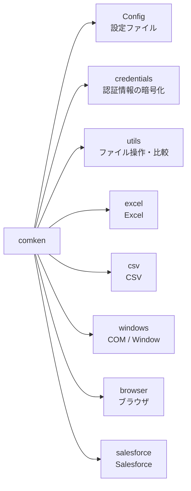
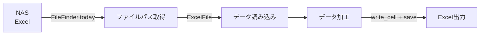
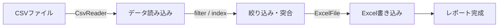

# original_libs

業務自動化で使う Python 共通ライブラリ。

- 設計方針・ユースケース: [仕様書.md](仕様書.md)
- コーディング規約: [CONVENTIONS.md](CONVENTIONS.md)
- エラーが出たときの対応: [ERRORS.md](ERRORS.md)（プロジェクトに配る雛形）

## モジュール一覧

| モジュール | 概要 |
|---|---|
| [Config](#config) | INI ファイルの読み込み |
| [Logger](#logger) | ロガーの初期化（日別ファイル + コンソール） |
| [認証情報（credentials）](#認証情報credentials) | パスワード等の暗号化保存（Windows DPAPI） |
| [CSV](#csv) | CSV の読み込み・検索・抽出 |
| [Excel（openpyxl）](#excel) | Excel の読み書き（数式・マクロは自動で win32com を使用） |
| [Windows（pywin32）](#windows) | Excel COM 操作・ウィンドウ操作・レジストリ読み取り |
| [Browser（Edge）](#browser) | Edge ブラウザ操作 |
| [Salesforce](#salesforce) | レコード CRUD・レポート取得 |

## 定数クラス一覧

選択肢を渡す引数には生の文字列ではなく、これらの定数を使う。

| 定数クラス | import | 用途 | 例 |
|---|---|---|---|
| `Color` | `from comken.excel import Color` | セルの背景色 | `set_fill(color=Color.RED)` |
| `SortBy` | `from comken.utils import SortBy` | FileFinder.latest の並び順 | `latest(by=SortBy.UPDATED)` |
| `Encoding` | `from comken.csv import Encoding` | CSV の文字コード | `CsvReader(path, encoding=Encoding.CP932)` |

---

## セットアップ

```bash
pip install -r requirements.txt
```

---

## Config

`config.ini` を `config.SECTION.KEY` の形式で読み込む。

```python
from comken.config import Config

config = Config() # カレントディレクトリの config.ini
config = Config("path/to/config.ini") # パスを指定する場合
```

```ini
; config.ini（プロジェクト固有の非機密設定を書く）
; パスワード等の機密情報は書かない → 認証情報（credentials）を使う
; セクション名・キー名は大文字で書く（固定値と分かる + Python 側と表記が一致する）
[CREDENTIALS]
SALESFORCE = salesforce

[REPORT]
OUTPUT_FOLDER = \\nas-server\reports
TEMPLATE_PATH = \\nas-server\templates\template.xlsx
```

```python
config.CREDENTIALS.SALESFORCE # → str
config.REPORT.OUTPUT_FOLDER # → str
config.REPORT.TEMPLATE_PATH # → str
```

**値の型変換ルール:**

| config.ini の値 | 返る型 |
|---|---|
| `true` / `false`（大文字小文字問わず） | bool に自動変換 |
| `yes` / `no` / `on` / `off` / `1` / `0` | **変換しない**（str のまま） |
| 数値（`10` など） | str のまま。必要なら呼び出し側で変換: `int(config.BROWSER.WAIT_SECONDS)` |
| その他の文字列 | str のまま |

bool 変換を `true` / `false` に限定しているのは、`1` が「数値の1」なのか「ON の意味」なのか
曖昧になる事故を避けるため。

**プロジェクト固有の設定を追加する場合は Config を継承する:**

```python
from pathlib import Path

class AppConfig(Config):
    @property
    def template_path(self) -> Path:
        # 複数の設定値からパスを組み立てる等、読み取り時の加工に @property を使う
        return Path(self.REPORT.OUTPUT_FOLDER) / self.REPORT.TEMPLATE_NAME

config = AppConfig()
```

なお**ブラウザの設定は config.ini には書かない**。`BrowserOptions` のサブクラス
（`src/browser_options.py`）で行う（[Browser](#browser) を参照）。

---

## Logger

main.py で1回だけ呼ぶ。以降サブモジュールは `logging.getLogger(__name__)` でそのまま出力される。

- `logs/main_YYYYMMDD.log` に DEBUG 以上を出力（日別ファイル）
- コンソールには INFO 以上を出力
- 2回呼んでもハンドラは重複しない

```python
# main.py
from comken import setup_logger

logger = setup_logger("main")
logger.info("処理開始")

# ログの出力先フォルダを変えたい場合は log_dir で指定する（なければ作成される）
logger = setup_logger("main", log_dir=r"\\nas-server\logs\my_project")
```

```python
# src/ 以下のモジュール
import logging

logger = logging.getLogger(__name__)
logger.info("CSV読み込み完了: %d件", len(rows))
```

---

## 認証情報（credentials）

パスワード・トークン・ユーザー名などの機密情報・個人情報を Windows DPAPI で暗号化して保存する。
config.ini には機密情報を書かず、このモジュールを使う。

**仕組み:**

- 保存先は `%USERPROFILE%\.comken\credentials.dat`（プロジェクト内には置かない）
- Windows がログオン中のアカウントに紐付けて暗号化する。鍵の管理は不要
- 同じ「ユーザー × PC」でないと復号できない。ファイルをコピーされても読まれない
- 逆に言うと、**実行する PC ごとに登録が必要**（別の PC やサーバーで実行する場合はそこでも登録する）
- 1ユーザーにつき1ファイルで、キー名1つに値1つを何件でも登録できる
- 「ユーザー名とパスワードが必ずセット」という決め打ちはしない。パスワードだけのシステムにも対応できる

### 登録・削除（対話式ツール）

非エンジニアでも使える。起動してメニューを選ぶだけ。

```
> python -m comken.credentials
=== comken 認証情報の管理 ===

登録済みのキー名:
  oju_sys_password

1: 登録（新規追加・上書き）
2: 削除
q: 終了
選択: 1

システム名（例: salesforce）: salesforce
salesforce は新しいシステム名です。この名前で登録しますか？（y で続行）: y
項目名（例: username / password / token。空 Enter で終了）: username
値（入力しても画面には表示されません）:
値（確認のためもう一度）:
保存しました: salesforce_username
項目名（例: username / password / token。空 Enter で終了）: password
値（入力しても画面には表示されません）:
値（確認のためもう一度）:
保存しました: salesforce_password
項目名（例: username / password / token。空 Enter で終了）: ← 空 Enter で終了
保存先: C:\Users\xxx\.comken\credentials.dat
```

- **システム名は1回だけ入力**し、項目（username / password / token…）を続けて登録できる。
  項目ごとにシステム名を打ち直さないので「password のときだけスペルミス」が起きない
- 新しいシステム名のときは確認が入る（既存システムに追加するつもりのタイプミスに気づける）
- 既存のシステム名なら登録済みの項目一覧が表示される
- 同じキー名なら「上書き（＝変更）」になる。パスワードを変えたいときも同じ名前で登録し直せばよい
- 値は打ち間違い防止のため2回入力する（画面には表示されない）

### コードからの利用

まとめて使う場合は `Credentials` にプレフィックスを渡して属性で取り出す（キー名の直書きを避けられる）。

```python
from comken.credentials import Credentials

sf = Credentials("salesforce")
sf.username # → salesforce_username の値
sf.password # → salesforce_password の値
```

1件だけなら `load_credential` を使う。

```python
from comken.credentials import load_credential

password = load_credential("oju_sys_password")
```

未登録のキー名を指定すると `CredentialNotFoundError` になる（登録コマンドを案内するメッセージ付き）。

### キー名の付け方

| ルール | 例 |
|---|---|
| `システム名_項目名` の形式にする | `salesforce_password`, `oju_sys_password` |
| アカウントを使い分けるときはシステム名に用途を含める | `salesforce_test_password` |

キー名に使えるのは**半角英数字とアンダースコアのみ**。
それ以外（漢字・スペース・記号）は `InvalidCredentialNameError` で弾かれる。

どのシステム名（プレフィックス）を使うかはプロジェクトの config.ini の `[CREDENTIALS]` セクションに書く（キー名は機密ではない）:

```ini
[CREDENTIALS]
SALESFORCE = salesforce
```

```python
sf = Credentials(config.CREDENTIALS.SALESFORCE)
sf.username, sf.password, sf.token
# SALESFORCE = salesforce_test に変えるだけで全項目がテスト用に切り替わる
```

### 必要な項目の宣言（まとめて登録）

プロジェクトのコード側で「使う認証情報」を宣言しておくと、
CLI をプロジェクトのフォルダで起動したときに「3: まとめて登録」メニューが出る。

```python
# src/credentials.py（プロジェクト側で宣言する）
REQUIRED_CREDENTIALS = {
    "SALESFORCE": ["username", "password", "token"],  # キーは config.ini [CREDENTIALS] のキー名
    "OJU_SYS": ["password"],
}
```

```
選択: 3

このプロジェクトが使う認証情報（コード内の REQUIRED_CREDENTIALS 宣言）:
  oju_sys_password: 登録済み
  salesforce_password: 未登録
  salesforce_token: 未登録
  salesforce_username: 未登録

未登録の 3 件を順番に登録します（中断は Ctrl+C）。

--- salesforce_username ---
値（入力しても画面には表示されません）:
値（確認のためもう一度）:
保存しました: salesforce_username
...
```

- **キー名を1文字も打たずに登録できる**ので、スペルミスの余地がない
- プレフィックスは config.ini の `[CREDENTIALS]` から解決される
  （`SALESFORCE = salesforce_test` にすると要求されるキーもテスト用に変わる）
- 宣言はコードの一部としてエンジニアが管理する。宣言にない項目もメニュー1で自由に登録できる
- CLI は宣言を AST で読み取るだけで、プロジェクトのコードを実行しない

---

## CSV

```python
from comken.csv.handler import CsvReader

ORDER_ID = "A001"
STAFF_NAME = "山田"

reader = CsvReader("data.csv")
# 文字コードは自動判定（UTF-8 → CP932 の順に試す）。明示する場合:
# from comken.csv import Encoding
# CsvReader("data.csv", encoding=Encoding.CP932)
```

data.csv の中身が以下だとする。

```
注文番号,金額,担当者
A001,1000,山田
A002,2000,山田
A003,3000,佐藤
```

```python
# 全行取得（1行 = 1辞書。キーはヘッダー名、値はすべて str）
rows = reader.rows()
# → [{"注文番号": "A001", "金額": "1000", "担当者": "山田"},
#    {"注文番号": "A002", "金額": "2000", "担当者": "山田"},
#    {"注文番号": "A003", "金額": "3000", "担当者": "佐藤"}]

# 特定列のみ取得（指定した列だけの辞書になる）
rows = reader.rows(columns=["注文番号", "金額"])
# → [{"注文番号": "A001", "金額": "1000"},
#    {"注文番号": "A002", "金額": "2000"},
#    {"注文番号": "A003", "金額": "3000"}]

# キーで1件検索（最初に一致した1行。見つからなければ None）
row = reader.find("注文番号", ORDER_ID)
# → {"注文番号": "A001", "金額": "1000", "担当者": "山田"}

# キーで複数行検索（一致した全行。一致なしなら空リスト []）
rows = reader.filter("担当者", STAFF_NAME)
# → [{"注文番号": "A001", ...}, {"注文番号": "A002", ...}]

# 列の値一覧（ヘッダー行は含まない）
amounts = reader.column("金額")
# → ["1000", "2000", "3000"]

# キー列でインデックス化（突合用。キーで行を直接引ける）
lookup = reader.index("注文番号")
# → {"A001": {"注文番号": "A001", "金額": "1000", "担当者": "山田"},
#    "A002": {"注文番号": "A002", "金額": "2000", "担当者": "山田"},
#    "A003": {"注文番号": "A003", "金額": "3000", "担当者": "佐藤"}}
```

**ヘッダー行がない CSV** は `headers` で列名を付ける（1行目からデータとして読まれる）。

```python
# 中身: "A001,1000\nA002,2000\n" （ヘッダーなし）
reader = CsvReader("no_header.csv", headers=["注文番号", "金額"])
reader.rows()
# → [{"注文番号": "A001", "金額": "1000"}, {"注文番号": "A002", "金額": "2000"}]
```

---

## ファイル名・ファイル取得ユーティリティ

### ファイルの移動・コピー（move_file / copy_file）

shutil を知らなくても使えるラッパー。ルールは共通で
「**dst が既存フォルダならその中へ、それ以外はファイルパス扱い（親フォルダ自動作成）、同名は上書き**」。

```python
from comken.utils import copy_file, move_file

move_file("report.xlsx", r"C:\作業\output")            # フォルダの中へ移動
move_file("report.xlsx", r"C:\作業\output\売上.xlsx")   # 名前を変えて移動（out フォルダがなければ作られる）
copy_file("report.xlsx", r"C:\作業\backup")             # コピー（元ファイルは残る。更新日時も保持）
# 返り値は移動・コピー後の Path
```

### ファイル名の組み立て・検索

```python
from comken.utils import FileFinder, FileNameBuilder

FOLDER = r"\\nas-server\share"

# 今日の日付付きファイル名を組み立てる
FileNameBuilder("売上レポート").plain()                # → "売上レポート.xlsx"
FileNameBuilder("売上レポート").prefix()               # → "20260711_売上レポート.xlsx"
FileNameBuilder("売上レポート").suffix()               # → "売上レポート_20260711.xlsx"
FileNameBuilder("ログ", ext=".csv").prefix()           # → "20260711_ログ.csv"
FileNameBuilder("月次レポート").prefix(date_format="%Y%m") # → "202607_月次レポート.xlsx"

# 今日の日付を含むファイルを取得（見つからなければ FileNotFoundError）
path = FileFinder(FOLDER).today()                      # YYYYMMDD で探す
path = FileFinder(FOLDER).today(date_format="%Y%m")    # YYYYMM で探す

# フォルダ内で最新のファイルを取得（見つからなければ FileNotFoundError）
# デフォルトは「ファイル名の辞書順で最後」= 日付プレフィックス命名なら名前上の最新。
# コピーや再保存で更新日時が変わっていても影響を受けない
from comken.utils import SortBy

path = FileFinder(FOLDER).latest()
path = FileFinder(FOLDER).latest(pattern="*.csv")        # CSV に絞る場合
path = FileFinder(FOLDER).latest(by=SortBy.UPDATED)      # 更新日時で選びたい場合

# 見つからなくても処理を続けたい場合は required=False（None が返る）
path = FileFinder(FOLDER).today(required=False)
if path is None:
    ...  # スキップ処理など
```

### ブラウザダウンロード用フォルダ（DownloadDir）

作成・完了待ち・後片付けを1つのオブジェクトで扱う。**with 文で使う**。

**使い分け（ファイルを残したいかどうかで選ぶ）:**

| やりたいこと | 書き方 | with を抜けたとき |
|---|---|---|
| ダウンロード → 処理したら消す（使い捨て） | `DownloadDir()` — 一時フォルダ | **自動削除される**（消し忘れゼロ） |
| ダウンロードしたものをそのまま残す | `DownloadDir(path=r"C:\作業\downloads")` — 固定フォルダ | 残る |

```python
from comken.utils import DownloadDir, move_file

# 使い捨て（一時フォルダ）: with を抜けると自動削除されるので、必要なファイルは with 内で移動する
with DownloadDir() as dl, EdgeDriver(download_dir=dl) as d:
    d.driver.get("https://example.com/download")
    # ... ダウンロード操作 ...
    files = dl.wait()                                # 完了まで待機（.crdownload が消えるまで）
    move_file(files[0], r"C:\作業\output")            # with 内で移動する
# ← ここで一時フォルダは自動削除

# 残す（固定フォルダ）: with を抜けてもフォルダとファイルはそのまま
with DownloadDir(path=r"C:\作業\downloads") as dl, EdgeDriver(download_dir=dl) as d:
    ...
    files = dl.wait()
```

- 固定フォルダの `wait()` は、作成時点で既にあったファイルを無視して新しく増えた分だけを返す
  （前回のダウンロードが残っていても誤検出しない）
- 固定フォルダは `remove()` を呼んでも警告だけで削除されない。本当に消すなら `remove(force=True)`

---

## ネットワーク・NAS ファイルの読み込み

NAS やネットワークドライブ上のファイルは直接開くと遅い・不安定になる場合がある。

### ExcelFile（openpyxl）

`local_copy_threshold_mb` を超えるファイルは自動でローカルにコピーしてから開く。
`with` ブロックを抜けるとテンポラリファイルは自動削除される。

```python
from comken.excel.handler import ExcelFile

NAS_PATH = r"\\nas-server\share\data.xlsx"
SHEET = "Sheet1"

# 10MB 以上は自動でローカルコピー（デフォルト）
with ExcelFile(NAS_PATH) as f:
    rows = f.read_rows_as_dicts(SHEET)

# 閾値を変える（50MB 以上でコピー）
with ExcelFile(NAS_PATH, local_copy_threshold_mb=50) as f:
    rows = f.read_rows_as_dicts(SHEET)

# ローカルコピーを無効化（社内ルールで不可の場合）
with ExcelFile(NAS_PATH, local_copy_threshold_mb=0) as f:
    rows = f.read_rows_as_dicts(SHEET)
```

### ExcelComHandler（win32com）

win32com は `ExcelFile` の自動コピー機能がないため、`local_copy` を使う。

```python
from comken.utils import local_copy
from comken.windows.handler import ExcelComHandler

NAS_PATH = r"\\nas-server\share\data.xlsx"
SHEET = "Sheet1"

with local_copy(NAS_PATH) as local_path:
    with ExcelComHandler(local_path) as h:
        rows = h.read_rows_as_dicts(SHEET)
```

---

## Excel

数式の計算結果や VBA マクロが必要な場合は自動で win32com にフォールバックする。

```python
from comken.excel.handler import ExcelFile

SHEET = "Sheet1"
ROW = 2
COL = 1
MACRO_NAME = "Module1.UpdateData"

# 読み取り
with ExcelFile("data.xlsx") as f:
    rows = f.read_rows(SHEET) # タプルのリスト
    rows = f.read_rows_as_dicts(SHEET) # 辞書のリスト（ヘッダーをキーに）

# 数式の計算結果を読む（openpyxl → win32com 自動フォールバック）
with ExcelFile("data.xlsx") as f:
    rows = f.read_computed_rows(SHEET)

# 書き込み・保存
with ExcelFile("data.xlsx") as f:
    f.write_cell(SHEET, row=ROW, col=COL, value="値")
    f.save()
    f.save("output.xlsx") # 別名で保存

# 大量データの読み取り（メモリ効率優先）
with ExcelFile("data.xlsx") as f:
    for row in f.iter_rows(SHEET):
        print(row) # 1行ずつ処理。全行をメモリに乗せない

# 複数ファイルを同時処理する場合（目安: 10ファイル以上）は
# concurrent.futures.ThreadPoolExecutor を使うと高速化できる

# 背景色の設定（よく使う色は Color 定数で指定できる）
from comken.excel import Color

with ExcelFile("data.xlsx") as f:
    f.set_fill(SHEET, row=ROW, col=COL, color=Color.YELLOW)
    f.set_fill(SHEET, row=ROW, col=COL, color=Color.RED)
    f.set_fill(SHEET, row=ROW, col=COL, color="CCE5FF") # 定数にない色は16進で
    f.save()

# 用意している色: RED / PINK / ORANGE / YELLOW / LIGHT_YELLOW / GREEN / LIGHT_GREEN
#                BLUE / LIGHT_BLUE / PURPLE / GRAY / LIGHT_GRAY / WHITE / BLACK

# VBA マクロの実行（常に win32com を使用）
with ExcelFile("data.xlsm") as f:
    f.run_macro(MACRO_NAME)
```

**数万行クラスの大きいファイルを扱うときのベストプラクティス:**

| やりたいこと | 方法 |
|---|---|
| 大量行を読む | `iter_rows()` で1行ずつ処理する（全行をメモリに乗せない） |
| NAS 上の大きいファイル | `local_copy_threshold_mb` の自動ローカルコピーに任せる（デフォルト10MB） |
| 大量行への書き込み | openpyxl（`ExcelFile.write_cell`）を使う。COM のセル単位書き込みは1呼び出しごとにプロセス間通信が発生して桁違いに遅い |
| COM でしかできない処理が大量行 | `transfer_by_key` 等はセル単位アクセスのため数万行では時間がかかる。可能なら openpyxl 側で処理してから COM は最後の保存・マクロだけに使う |

---

## Windows

通常の Excel 読み書きは ExcelFile（openpyxl）を使うこと。
ExcelComHandler は数式・マクロ・パスワード保存が必要な場合に限定して使う。

### ExcelComHandler

```python
from comken.windows.handler import ExcelComHandler

SHEET = "Sheet1"
DATA_ROW = 2
DATA_COL = 3
CHECK_ROW = 5
MACRO_NAME = "Module1.UpdateData"
READ_PW = "読み取りPW"
WRITE_PW = "書き込みPW"

with ExcelComHandler("data.xlsx") as h:
    value = h.read_cell(SHEET, row=DATA_ROW, col=DATA_COL)
    rows = h.read_rows(SHEET)
    rows = h.read_rows_as_dicts(SHEET)
    last_row = h.used_last_row(SHEET)

    if h.count_a(SHEET, row=CHECK_ROW) == 0:
        print(f"{CHECK_ROW}行目は空行")

    h.run_macro(MACRO_NAME)
    h.save_as("output.xlsx", read_pw=READ_PW, write_pw=WRITE_PW)
    # パスワードはそれぞれ省略可。読み取りPWだけ・書き込みPWだけの保護もできる
    # h.save_as("output.xlsx", read_pw=READ_PW)  # 読み取り保護のみ
```

**キー突合で転記する（XLOOKUP 的転記）:**

キー列の値で lookup を引き、一致した行に列マッピングに従って値を書き込む。
空行・キーが空の行・lookup にないキーの行は自動でスキップされる。

```python
lookup = CsvReader("data.csv").index("注文番号")
# → {"A001": {"注文番号": "A001", "顧客名": "株式会社A", ...}, ...}

MAPPING = {"A": "顧客名", "B": "金額"}  # Excel の列レター → lookup の列名

with ExcelComHandler("data.xlsx") as h:
    matched = h.transfer_by_key(SHEET, key_col="Q", lookup=lookup, column_mapping=MAPPING)
    h.save_as("output.xlsx")

print(f"{matched}件転記した")
```

### WindowHandler

```python
from comken.windows.handler import WindowHandler

WINDOW_TITLE = "メモ帳"

w = WindowHandler(WINDOW_TITLE)
w.activate() # ウィンドウを前面に表示
w.get_title() # タイトルを取得
```

### RegistryHandler

```python
import win32con
from comken.windows.handler import RegistryHandler

SETTING_KEY = "SettingName"

with RegistryHandler(win32con.HKEY_CURRENT_USER, r"Software\MyApp") as r:
    value = r.read(SETTING_KEY)
```

---

## Browser

### EdgeDriver

```python
from comken.browser.driver import EdgeDriver

URL = "https://example.com"

# デフォルト設定のまま起動
with EdgeDriver() as d:
    d.driver.get(URL)
```

**ブラウザオプションのカスタマイズ:**

デフォルト設定は `comken/browser/options.py` の `BrowserOptions` を参照。
変更したい項目だけサブクラスで上書きする。`DRIVER_PATH` と `WAIT_SECONDS` もここで変更する。

```python
# browser_options.py（プロジェクト側）
from comken.browser.options import BrowserOptions

class MyOptions(BrowserOptions):
    DRIVER_PATH = r"C:\tools\msedgedriver.exe" # ドライバーパスを変更する場合
    WAIT_SECONDS = 15 # 待機秒数を変更する場合
    INCOGNITO = False # シークレットモードを無効
    START_MAXIMIZED = False # 最大化を無効（WINDOW_SIZE と併用不可）
    WINDOW_SIZE = "1600,1024"
```

```python
with EdgeDriver(browser_options=MyOptions()) as d:
    ...
```

デフォルト一覧の確認:

```python
print(BrowserOptions()) # デフォルト設定を表示
print(MyOptions()) # デフォルトからの変更箇所に * が付く
```

---

### BasePage

画面ごとに `BasePage` を継承したクラスを作る。

```python
from comken.browser.base_page import BasePage

class LoginPage(BasePage):
    URL = "https://example.com/login"
    USERNAME_ID = "username"
    PASSWORD_ID = "password"
    LOGIN_BTN_ID = "login-btn"

    def open(self) -> None:
        self._driver.get(self.URL)

    def login(self, username: str, password: str) -> None:
        self.input_id(self.USERNAME_ID, username)
        self.input_id(self.PASSWORD_ID, password)
        self.click_id(self.LOGIN_BTN_ID)
```

**セレクター別メソッド一覧:**

メソッド名は「`返すもの/動作` + `_セレクター種別`」の2部構成。
複数形かどうかは前半（返すもの）で決まる: `texts_css` はテキストの**リスト**を返すので複数形、
`count_css` は件数という**1個の数値**を返すので単数形。末尾の `_css` / `_id` はセレクター種別なので常に単数。

| 操作 | ID | name属性 | CSSセレクター | XPath |
|---|---|---|---|---|
| クリック | `click_id` | `click_name` | `click_css` | `click_xpath` |
| テキスト入力 | `input_id` | `input_name` | `input_css` | `input_xpath` |
| テキスト取得 | `text_id` | `text_name` | `text_css` | `text_xpath` |
| プルダウン（テキスト） | `select_text_id` | `select_text_name` | `select_text_css` | `select_text_xpath` |
| プルダウン（value） | `select_value_id` | `select_value_name` | `select_value_css` | `select_value_xpath` |
| プルダウン（番号） | `select_index_id` | `select_index_name` | `select_index_css` | `select_index_xpath` |
| 要素が出るまで待つ | `wait_visible_id` | — | `wait_visible_css` | `wait_visible_xpath` |
| 要素が消えるまで待つ | — | — | `wait_invisible_css` | `wait_invisible_xpath` |
| 要素の存在チェック | `has_id` | — | `has_css` | `has_xpath` |
| スクロール（要素まで） | `scroll_to_id` | — | `scroll_to_css` | — |

**複数要素の扱い:**

同じセレクターに複数の要素が一致する場合に使う。本来 id は一意だが、複数ある画面も実在するため id 版もある。

| 操作 | ID | name属性 | CSSセレクター | XPath |
|---|---|---|---|---|
| 要素の数を数える | `count_id` | — | `count_css` | `count_xpath` |
| 全要素のテキスト取得 | `texts_id` | — | `texts_css` | `texts_xpath` |
| n番目をクリック | `click_id(v, index=1)` | `click_name(v, index=1)` | `click_css(v, index=1)` | `click_xpath(v, index=1)` |

使い分けの優先順位:

1. **セレクター側で一意に絞り込む（原則）** — 例: `"table tr:nth-child(2) .edit-btn"`
2. リストで取得して選ぶ — `texts_css` / `count_css`
3. 何番目かを直接指定（最終手段） — `click_css(selector, index=1)`（0始まり）

**セレクター不要のメソッド:**

| メソッド | 用途 |
|---|---|
| `select_radio_name(name, value)` | ラジオボタンを name + value で選択 |
| `alert_accept()` | アラートを OK する |
| `alert_dismiss()` | アラートをキャンセルする |
| `alert_text()` | アラートのテキストを取得 |
| `scroll_bottom()` | ページ最下部へスクロール |
| `drag_drop_css(source, target)` | ドラッグ＆ドロップ |
| `js(script, *args)` | JavaScript を実行 |
| `save_screenshot(prefix)` | スクリーンショットを保存 |

セレクターの値は Edge の開発者ツール（F12）で確認する。
`input_*` は入力前に既存の値を自動でクリアする（clear() → send_keys() の順）。

---

### サンプル実装

`examples/sample_login/` に動作するサンプルがある。

```
examples/sample_login/
├── pages/
│   ├── login_page.py # ログイン画面
│   └── secure_page.py # ログイン後の画面
├── browser_options.py # BrowserOptions のカスタマイズ
├── config.ini.example # 設定ファイルのテンプレート
├── config.py # AppConfig（Config のサブクラス）
└── run.py # 実行スクリプト
```

実行:

```bash
cd F:\dev\original_libs
python -m examples.sample_login.run
```

---

## Salesforce

### SalesforceClient（simple-salesforce）

```python
from comken.credentials import Credentials
from comken.salesforce.simple_sf import SalesforceClient

# 事前に python -m comken.credentials で登録しておく
cred = Credentials("salesforce") # 本番・テストの切り替えは config.ini のプレフィックスで
sf = SalesforceClient(
    username=cred.username,
    password=cred.password,
    security_token=cred.token,
    # domain="test" # Sandbox の場合
)

SOQL = "SELECT Id, Name FROM Account WHERE IsDeleted = false"
EXTERNAL_ID = "001"

records = sf.query(SOQL)
new_id = sf.insert("Account", {"Name": "新規取引先"})
sf.update("Account", record_id=new_id, data={"Name": "更新後の名前"})
sf.upsert("Account", external_id_field="ExternalId__c", data={"ExternalId__c": EXTERNAL_ID, "Name": "取引先"})
sf.delete("Account", record_id=new_id)
```

### SalesforceRestClient（REST API）

```python
from comken.salesforce.rest_api import SalesforceRestClient

sf = SalesforceRestClient.from_password(
    username="user@example.com",
    password="password",
    security_token="トークン",
    client_id="クライアントID",
    client_secret="クライアントシークレット",
)

SOQL = "SELECT Id, Name FROM Account"
ACCOUNT_NAME = "新規取引先"
ACCOUNT_NAME_UPDATED = "更新後"

records = sf.query(SOQL)
new_id = sf.insert("Account", {"Name": ACCOUNT_NAME})
sf.update("Account", record_id=new_id, data={"Name": ACCOUNT_NAME_UPDATED})
sf.delete("Account", record_id=new_id)
```

### SalesforceReportClient（レポート取得）

```python
from comken.salesforce.report import SalesforceReportClient

sf = SalesforceReportClient(
    instance_url="https://xxx.salesforce.com",
    access_token="アクセストークン",
)

REPORT_ID = "00O000000000001"
START_DATE = "2026-01-01"

# 2000行以下（同期）
rows = sf.run(REPORT_ID)
# → [{"取引先名": "株式会社A", "金額": "100,000"}, ...]

# 2000行超え（非同期）
rows = sf.run_async(REPORT_ID)

# 絞り込みあり
rows = sf.run(REPORT_ID, filters=[
    {"column": "CREATED_DATE", "operator": "greaterThan", "value": START_DATE},
])
```

レポート ID は Salesforce でレポートを開いたときの URL から確認できる:
`https://xxx.salesforce.com/00O000000000001`

---

## パッケージ構成



---

## 主なユースケース

### NAS の Excel を読んで加工・出力する



### CSV を読んで Excel レポートを作る



### Salesforce のデータを Excel に出力する


### ブラウザを自動操作する


---

## 改訂履歴

| 日付 | 内容 |
|---|---|
| 2026-07-09 | 初版作成 |
| 2026-07-10 | 全モジュールにドキュメント追加、README 整理 |
| 2026-07-11 | credentials モジュール追加（認証情報の暗号化保存・管理ツール） |
