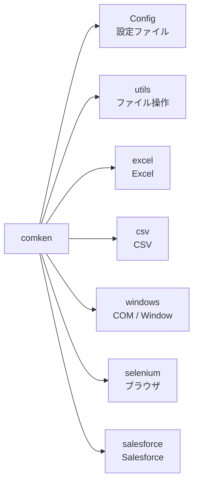
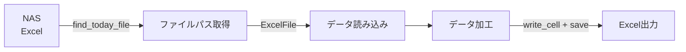

# original_libs

業務自動化で使う Python 共通ライブラリ。

## モジュール一覧

| モジュール | 概要 |
|---|---|
| [Config](#config) | INI ファイルの読み込み |
| [CSV](#csv) | CSV の読み込み・検索・抽出 |
| [Excel（openpyxl）](#excel) | Excel の読み書き（数式・マクロは自動で win32com を使用） |
| [Windows（pywin32）](#windows) | Excel COM 操作・ウィンドウ操作・レジストリ読み取り |
| [Selenium（Edge）](#selenium) | Edge ブラウザ操作 |
| [Salesforce](#salesforce) | レコード CRUD・レポート取得 |

---

## パッケージ構成



---

## 主なユースケース

### NAS の Excel を読んで加工・出力する



### CSV を読んで Excel レポートを作る


### Salesforce のデータを Excel に出力する


### ブラウザを自動操作する


---

## セットアップ

```bash
pip install -r requirements.txt
```

---

## Config

`config.ini` を `config.SECTION.KEY` の形式で読み込む。

```python
from comken.config import Config

config = Config() # カレントディレクトリの config.ini
config = Config("path/to/config.ini") # パスを指定する場合
```

```ini
; config.ini
[browser]
driver_path = C:\Users\Public\Documents\msedgedriver.exe
wait_seconds = 10
headless = false
```

```python
config.BROWSER.DRIVER_PATH # → str
config.BROWSER.HEADLESS # → False（bool に自動変換）
config.BROWSER.WAIT_SECONDS # → "10"（数値は呼び出し側で変換）
int(config.BROWSER.WAIT_SECONDS) # → 10
```

**プロジェクト固有の設定を追加する場合は Config を継承する:**

```python
class AppConfig(Config):
    @property
    def add_args(self) -> list[str]:
        return self.parse_list(self.BROWSER_OPTIONS.ADD)

config = AppConfig()
```

---

## CSV

```python
from comken.csv.handler import CsvReader

ORDER_ID = "A001"
STAFF_NAME = "山田"

reader = CsvReader("data.csv")
# Shift-JIS の場合: CsvReader("data.csv", encoding="cp932")

# 全行取得
rows = reader.rows()
# → [{"注文番号": "A001", "金額": "1000"}, ...]

# 特定列のみ取得
rows = reader.rows(columns=["注文番号", "金額"])

# キーで1件検索（見つからなければ None）
row = reader.find("注文番号", ORDER_ID)

# キーで複数行検索
rows = reader.filter("担当者", STAFF_NAME)

# 列の値一覧
amounts = reader.column("金額")
# → ["1000", "2000", "3000"]

# キー列でインデックス化（突合用）
lookup = reader.index("注文番号")
# → {"A001": {...}, "A002": {...}}
```

---

## ファイル名・ファイル取得ユーティリティ

```python
from comken.utils import dated_filename, find_today_file, find_latest_file

FOLDER = r"\\nas-server\share"

# 今日の日付付きファイル名を生成
dated_filename("売上レポート")                         # → "20260710_売上レポート.xlsx"
dated_filename("売上レポート", pre=False)              # → "売上レポート_20260710.xlsx"
dated_filename("月次レポート", date_format="%Y%m")     # → "202607_月次レポート.xlsx"
dated_filename("ログ", suffix=".csv")                  # → "20260710_ログ.csv"

# 今日の日付を含むファイルを取得
path = find_today_file(FOLDER)                         # YYYYMMDD で探す
path = find_today_file(FOLDER, date_format="%Y%m")     # YYYYMM で探す
if path is None:
    raise FileNotFoundError("今日のファイルが見つかりません")

# フォルダ内で最も新しいファイルを取得
path = find_latest_file(FOLDER)
path = find_latest_file(FOLDER, pattern="*.csv") # CSV に絞る場合
```

---

## ネットワーク・NAS ファイルの読み込み

NAS やネットワークドライブ上のファイルは直接開くと遅い・不安定になる場合がある。

### ExcelFile（openpyxl）

`local_copy_threshold_mb` を超えるファイルは自動でローカルにコピーしてから開く。
`with` ブロックを抜けるとテンポラリファイルは自動削除される。

```python
from comken.excel.handler import ExcelFile

NAS_PATH = r"\\nas-server\share\data.xlsx"
SHEET = "Sheet1"

# 10MB 以上は自動でローカルコピー（デフォルト）
with ExcelFile(NAS_PATH) as f:
    rows = f.read_rows_as_dicts(SHEET)

# 閾値を変える（50MB 以上でコピー）
with ExcelFile(NAS_PATH, local_copy_threshold_mb=50) as f:
    rows = f.read_rows_as_dicts(SHEET)

# ローカルコピーを無効化（社内ルールで不可の場合）
with ExcelFile(NAS_PATH, local_copy_threshold_mb=0) as f:
    rows = f.read_rows_as_dicts(SHEET)
```

### ExcelComHandler（win32com）

win32com は `ExcelFile` の自動コピー機能がないため、`local_copy` を使う。

```python
from comken.utils import local_copy
from comken.windows.handler import ExcelComHandler

NAS_PATH = r"\\nas-server\share\data.xlsx"
SHEET = "Sheet1"

with local_copy(NAS_PATH) as local_path:
    with ExcelComHandler(local_path) as h:
        rows = h.read_rows_as_dicts(SHEET)
```

---

## Excel

数式の計算結果や VBA マクロが必要な場合は自動で win32com にフォールバックする。

```python
from comken.excel.handler import ExcelFile

SHEET = "Sheet1"
ROW = 2
COL = 1
MACRO_NAME = "Module1.UpdateData"

# 読み取り
with ExcelFile("data.xlsx") as f:
    rows = f.read_rows(SHEET) # タプルのリスト
    rows = f.read_rows_as_dicts(SHEET) # 辞書のリスト（ヘッダーをキーに）

# 数式の計算結果を読む（openpyxl → win32com 自動フォールバック）
with ExcelFile("data.xlsx") as f:
    rows = f.read_computed_rows(SHEET)

# 書き込み・保存
with ExcelFile("data.xlsx") as f:
    f.write_cell(SHEET, row=ROW, col=COL, value="値")
    f.save()
    f.save("output.xlsx") # 別名で保存

# 大量データの読み取り（メモリ効率優先）
with ExcelFile("data.xlsx") as f:
    for row in f.iter_rows(SHEET):
        print(row) # 1行ずつ処理。全行をメモリに乗せない

# 複数ファイルを同時処理する場合（目安: 10ファイル以上）は
# concurrent.futures.ThreadPoolExecutor を使うと高速化できる

# 背景色の設定
YELLOW = "FFFF00"
RED = "FF0000"

with ExcelFile("data.xlsx") as f:
    f.set_fill(SHEET, row=ROW, col=COL, color=YELLOW) # 黄色
    f.set_fill(SHEET, row=ROW, col=COL, color=RED)    # 赤
    f.save()

# VBA マクロの実行（常に win32com を使用）
with ExcelFile("data.xlsm") as f:
    f.run_macro(MACRO_NAME)
```

---

## Windows

通常の Excel 読み書きは ExcelFile（openpyxl）を使うこと。
ExcelComHandler は数式・マクロ・パスワード保存が必要な場合に限定して使う。

### ExcelComHandler

```python
from comken.windows.handler import ExcelComHandler

SHEET = "Sheet1"
DATA_ROW = 2
DATA_COL = 3
CHECK_ROW = 5
MACRO_NAME = "Module1.UpdateData"
READ_PW = "読み取りPW"
WRITE_PW = "書き込みPW"

with ExcelComHandler("data.xlsx") as h:
    value = h.read_cell(SHEET, row=DATA_ROW, col=DATA_COL)
    rows = h.read_rows(SHEET)
    rows = h.read_rows_as_dicts(SHEET)
    last_row = h.used_last_row(SHEET)

    if h.count_a(SHEET, row=CHECK_ROW) == 0:
        print(f"{CHECK_ROW}行目は空行")

    h.run_macro(MACRO_NAME)
    h.save_as("output.xlsx", read_pw=READ_PW, write_pw=WRITE_PW)
```

### WindowHandler

```python
from comken.windows.handler import WindowHandler

WINDOW_TITLE = "メモ帳"

w = WindowHandler(WINDOW_TITLE)
w.activate() # ウィンドウを前面に表示
w.get_title() # タイトルを取得
```

### RegistryHandler

```python
import win32con
from comken.windows.handler import RegistryHandler

SETTING_KEY = "SettingName"

with RegistryHandler(win32con.HKEY_CURRENT_USER, r"Software\MyApp") as r:
    value = r.read(SETTING_KEY)
```

---

## Selenium

### EdgeDriver

```python
from comken.selenium.driver import EdgeDriver
from comken.selenium.options import BrowserOptions

DRIVER_PATH = r"C:\Users\Public\Documents\msedgedriver.exe"
URL = "https://example.com"

with EdgeDriver(driver_path=DRIVER_PATH) as d:
    d.driver.get(URL)
```

**ブラウザオプションのカスタマイズ:**

デフォルト設定は `comken/selenium/options.py` の `BrowserOptions` を参照。
変更したい項目だけサブクラスで上書きする。

```python
# browser_options.py（プロジェクト側）
from comken.selenium.options import BrowserOptions

class MyOptions(BrowserOptions):
    INCOGNITO = False # シークレットモードを無効
    START_MAXIMIZED = False # 最大化を無効（WINDOW_SIZE と併用不可）
    WINDOW_SIZE = "1600,1024"
```

```python
with EdgeDriver(
    driver_path=config.BROWSER.DRIVER_PATH,
    wait_seconds=int(config.BROWSER.WAIT_SECONDS),
    browser_options=MyOptions(),
) as d:
    ...
```

デフォルト一覧の確認:

```python
print(BrowserOptions()) # デフォルト設定を表示
print(MyOptions()) # デフォルトからの変更箇所に * が付く
```

---

### BasePage

画面ごとに `BasePage` を継承したクラスを作る。

```python
from comken.selenium.base_page import BasePage

class LoginPage(BasePage):
    URL = "https://example.com/login"
    USERNAME_ID = "username"
    PASSWORD_ID = "password"
    LOGIN_BTN_ID = "login-btn"

    def open(self) -> None:
        self._driver.get(self.URL)

    def login(self, username: str, password: str) -> None:
        self.input_id(self.USERNAME_ID, username)
        self.input_id(self.PASSWORD_ID, password)
        self.click_id(self.LOGIN_BTN_ID)
```

| 操作 | ID | name属性 | CSSセレクター | XPath |
|---|---|---|---|---|
| クリック | `click_id` | `click_name` | `click_css` | `click_xpath` |
| テキスト入力 | `input_id` | `input_name` | `input_css` | `input_xpath` |
| テキスト取得 | `text_id` | `text_name` | `text_css` | `text_xpath` |

セレクターの値は Edge の開発者ツール（F12）で確認する。

---

### サンプル実装

`examples/sample_login/` に動作するサンプルがある。

```
examples/sample_login/
├── pages/
│   ├── login_page.py # ログイン画面
│   └── secure_page.py # ログイン後の画面
├── browser_options.py # BrowserOptions のカスタマイズ
├── config.ini.example # 設定ファイルのテンプレート
├── config.py # AppConfig（Config のサブクラス）
└── run.py # 実行スクリプト
```

実行:

```bash
cd F:\dev\original_libs
python -m examples.sample_login.run
```

---

## Salesforce

### SalesforceClient（simple-salesforce）

```python
from comken.salesforce.simple_sf import SalesforceClient

sf = SalesforceClient(
    username="user@example.com",
    password="password",
    security_token="セキュリティトークン",
    # domain="test" # Sandbox の場合
)

SOQL = "SELECT Id, Name FROM Account WHERE IsDeleted = false"
EXTERNAL_ID = "001"

records = sf.query(SOQL)
new_id = sf.insert("Account", {"Name": "新規取引先"})
sf.update("Account", record_id=new_id, data={"Name": "更新後の名前"})
sf.upsert("Account", external_id_field="ExternalId__c", data={"ExternalId__c": EXTERNAL_ID, "Name": "取引先"})
sf.delete("Account", record_id=new_id)
```

### SalesforceRestClient（REST API）

```python
from comken.salesforce.rest_api import SalesforceRestClient

sf = SalesforceRestClient.from_password(
    username="user@example.com",
    password="password",
    security_token="トークン",
    client_id="クライアントID",
    client_secret="クライアントシークレット",
)

SOQL = "SELECT Id, Name FROM Account"
ACCOUNT_NAME = "新規取引先"
ACCOUNT_NAME_UPDATED = "更新後"

records = sf.query(SOQL)
new_id = sf.insert("Account", {"Name": ACCOUNT_NAME})
sf.update("Account", record_id=new_id, data={"Name": ACCOUNT_NAME_UPDATED})
sf.delete("Account", record_id=new_id)
```

### SalesforceReportClient（レポート取得）

```python
from comken.salesforce.report import SalesforceReportClient

sf = SalesforceReportClient(
    instance_url="https://xxx.salesforce.com",
    access_token="アクセストークン",
)

REPORT_ID = "00O000000000001"
START_DATE = "2026-01-01"

# 2000行以下（同期）
rows = sf.run(REPORT_ID)
# → [{"取引先名": "株式会社A", "金額": "100,000"}, ...]

# 2000行超え（非同期）
rows = sf.run_async(REPORT_ID)

# 絞り込みあり
rows = sf.run(REPORT_ID, filters=[
    {"column": "CREATED_DATE", "operator": "greaterThan", "value": START_DATE},
])
```

レポート ID は Salesforce でレポートを開いたときの URL から確認できる:
`https://xxx.salesforce.com/00O000000000001`

---

## 改訂履歴

| 日付 | 内容 |
|---|---|
| 2026-07-09 | 初版作成 |
| 2026-07-10 | 全モジュールにドキュメント追加、README 整理 |
