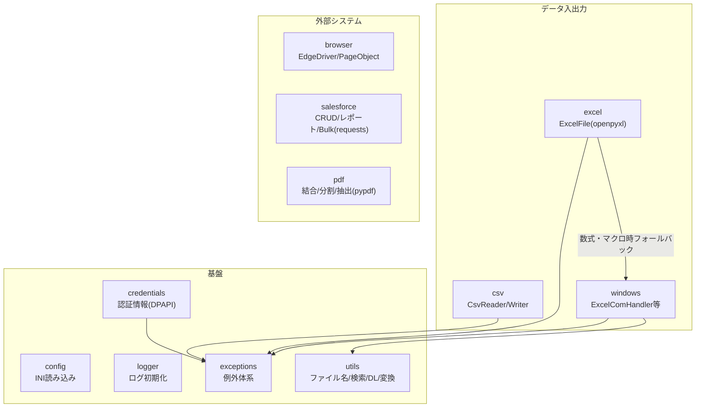

# comken 仕様書（エンジニア向け）

各モジュールの使い方（コード例）は README.md、コーディング規約は CONVENTIONS.md を参照。
この文書はライブラリの設計方針・ユースケース・設計判断を記録する。

## 目次

1. [概要と設計方針](#1-概要と設計方針)
2. [全体構成](#2-全体構成) … モジュール一覧・依存関係
3. [ユースケース](#3-ユースケース) … UC1〜UC7
4. [主要な設計判断](#4-主要な設計判断)
   - 4.1 config.ini は非機密のみ・大文字
   - 4.2 ブラウザ設定は config.ini ではなくクラス変数
   - 4.3 認証情報（credentials）
   - 4.4 ExcelFile と ExcelComHandler の使い分け
   - 4.5 見つからない・失敗はデフォルトで例外
5. [例外体系](#5-例外体系)
6. [動作環境・依存](#6-動作環境依存) … 必須・オプション依存の一覧
7. [テスト](#7-テスト) … カバー範囲・契約テスト・未テスト領域
8. [参照・運用](#8-参照運用)
   - 参照方式（共有サーバーを直接参照）
   - リリース手順（バージョンアップ）… 番号の付け方・注意点・ロールバック・開発版の事前検証
   - 互換性ポリシー
   - PC の交換・アカウント変更時の手順
   - パッケージ名の変更（rename_package.py）

---

## 1. 概要と設計方針

社内業務自動化（Excel・CSV・ブラウザ・Salesforce・Windows 操作）の共通処理を集めたライブラリ。
マクロ（VBA）で行っていた業務の Python 移行を主な用途とする。

| 方針 | 内容 |
|---|---|
| 可読性最優先 | 短く賢いコードより、半年後に読めるコード。bool 引数よりメソッド名で意味を表す |
| 非エンジニア協業前提 | エラーメッセージに対処法を含める。設定は config.ini、認証情報は対話式ツールで登録 |
| オフライン環境で動く | 社内 BO 環境では pip が使えない。依存は最小限にし、標準ライブラリを優先 |
| 失敗は早く・明確に | ファイルなし・認証情報なしは即例外。握りつぶさない |
| YAGNI | 3箇所で同じ処理が出るまで共通化しない（今後絶対使うものは例外） |

---

## 2. 全体構成



| モジュール | 責務 | 依存 |
|---|---|---|
| `config` | config.ini を `config.SECTION.KEY`（大文字）で読む | 標準のみ |
| `logger` | 日別ファイル + コンソールのログ初期化 | 標準のみ |
| `exceptions` | 全例外の定義（`OriginalLibsError` 基底） | なし |
| `credentials` | 認証情報の DPAPI 暗号化保存・取得・管理 CLI | pywin32 |
| `utils` | ファイル名生成・ファイル検索・ダウンロード管理・データ変換 | 標準のみ |
| `csv` | CSV の読み書き・検索・索引化 | 標準のみ |
| `excel` | Excel 読み書き（openpyxl）。数式・マクロは windows へフォールバック | openpyxl |
| `windows` | Excel COM・ウィンドウ・レジストリ操作 | pywin32 |
| `browser` | Edge WebDriver・Page Object 基盤 | selenium |
| `salesforce` | CRUD・SOQL・レポート・Bulk 2.0 | requests（simple-salesforce 版は任意） |
| `pdf` | PDF の結合・分割・テキスト抽出。導入不可なら**フォルダごと削除してよい** | pypdf |
| `runtime` | 実行モード（set_debug: 処理時間を DEBUG ログ / set_dry_run: 外部影響のある操作をスキップ）。バージョンは comken.__version__（定義はここ1箇所。pyproject は dynamic version で参照） | なし |

原則: **上のモジュールは下（基盤）に依存してよいが、基盤は業務モジュールに依存しない。**

---

## 3. ユースケース

| ID | 業務シナリオ | 使用モジュールの流れ |
|---|---|---|
| UC1 | NAS 上の当日 Excel を加工して出力 | `FileFinder.today` → `ExcelFile`（大容量は自動ローカルコピー）→ 加工 → `save` |
| UC2 | CSV を Excel 帳票へキー突合転記 | `CsvReader.index` → `ExcelFile.transfer_by_key` → `save`（数式再計算・PW付き保存が必要なら `ExcelComHandler` 版） |
| UC3 | Web サイトからファイルを取得して処理 | `Credentials` → `EdgeDriver` + `SitePage` → `DownloadDir.wait` → `ExcelFile` / `CsvReader` |
| UC4 | Salesforce のデータを Excel 出力 | `Credentials` → `SalesforceApiClient.run_report` → `ExcelFile.write_cell` |
| UC5 | 既存 VBA マクロを段階的に移行 | `ExcelComHandler.run_macro`（マクロを残したまま前後処理を Python 化）|
| UC6 | 2つのデータの差分チェック | `CsvReader.rows` ×2 → `diff_rows` → 差分を Excel / ログ出力 |
| UC7 | 非エンジニアの初回セットアップ | `python -m comken.credentials --gui`（GUI）または対話式 →「まとめて登録」（`REQUIRED_CREDENTIALS` 宣言を読む）|

---

## 4. 主要な設計判断

### 4.1 config.ini は非機密のみ・大文字

- config.ini は非エンジニアが触る前提。パスワード・個人情報は書かず credentials に分離
- セクション名・キー名は大文字で書き、Python 側の `config.SECTION.KEY` と表記を一致させる
  （`Config` は内部で `.upper()` するため、小文字の ini でも動くが表記のズレが混乱を生む）
- 自動変換するのは `true` / `false` の bool 変換のみ。yes / no / on / off / 1 / 0 や数値は
  文字列のまま返し、必要な変換は呼び出し側で行う（暗黙変換による事故を避ける）

### 4.2 ブラウザ設定は config.ini ではなくクラス変数

`DRIVER_PATH` / `WAIT_SECONDS` 等はプロジェクト固有ではなく環境共通のデフォルトであるため、
`BrowserOptions` のクラス変数として持ち、プロジェクトはサブクラスで差分だけ上書きする。

### 4.3 認証情報（credentials）

| 判断 | 理由 |
|---|---|
| Windows DPAPI（ユーザー × PC 紐付け） | 鍵管理が不要。ファイルを持ち出されても復号不可。1人1アカウント運用が前提 |
| 保存先は `%USERPROFILE%\.comken\credentials.dat` | プロジェクト外に置くことで commit 事故を防ぎ、全プロジェクトで共有できる |
| キー1つ＝値1つのフラット構造 | 「username と password が必ずセット」という決め打ちを避ける |
| キー名は `システム名_項目名`（半角英数字+_のみ） | config.ini・コードに書く値のため。違反は `InvalidCredentialNameError` |
| `Credentials(prefix)` の属性アクセス | キー名の直書き（マジックナンバー化）を防ぎ、config.ini のプレフィックス変更だけで本番/テストを一括切り替え |
| 必要キーは `REQUIRED_CREDENTIALS` としてコード側に宣言 | 「コードが何を使うか」はコードの事実。CLI が AST で読み（実行せず）、まとめて登録メニューを出す |

### 4.4 ExcelFile と ExcelComHandler の使い分け

- 通常の読み書きは `ExcelFile`（openpyxl。Excel 不要・高速）
- 数式の計算結果・VBA マクロ・パスワード付き保存が必要なときだけ `ExcelComHandler`（COM。Excel 必須）
- `ExcelFile` は必要時に内部で COM へ自動フォールバックする

### 4.5 見つからない・失敗はデフォルトで例外

`FileFinder.today/latest`、`load_credential` 等は見つからない場合に即例外
（業務スクリプトは「なければ止まって人に知らせる」が正解のため）。
続行したい場合のみ `required=False` を指定する。例外メッセージには対処法・登録コマンドを含める。

---

## 5. 例外体系

```
OriginalLibsError                 ← まとめて捕捉する場合はこれ
├── ExcelError
│   ├── SheetNotFoundError
│   └── MacroError
├── CsvError
├── ColumnNotFoundError
├── ConfigError
├── SalesforceError                   ← API 呼び出し失敗（ログイン失敗には対処法つき）
└── CredentialError
    ├── CredentialNotFoundError   ← 登録コマンドを案内するメッセージ付き
    └── InvalidCredentialNameError
```

方針:
- 素の `ValueError` / `Exception` は投げない（呼び出し側で判別できるようにする）
- メッセージは「何が・どこで・どうすればよいか」を含める（非エンジニアが読む前提）
- 行処理のエラーは行番号を含めて再送出する（`transfer_by_key` 等）

---

## 6. 動作環境・依存

| 項目 | 内容 |
|---|---|
| Python | 3.10 以上（`unzip` は 3.11 の機能を使うが 3.10 向けフォールバックあり。実行環境は 3.14） |
| OS | Windows（credentials / windows / browser は Windows 専用） |
| 必須依存 | openpyxl, selenium, pywin32 |
| オプション依存 | requests（salesforce）、simple-salesforce（同 SalesforceClient/BulkClient）、pypdf（pdf） |
| 参照方法 | 共有サーバーに置き、各 PC は `PYTHONPATH` で直接参照（8章参照。`pip install` はしない） |

オプション依存は該当フォルダ（salesforce / pdf）を使わなければ不要。
requests が導入できない環境では salesforce フォルダごと削除してよい。

---

## 7. テスト

- `tests/` に pytest。実行: `python -m pytest tests -q`
- config / csv / excel（openpyxl）/ utils / credentials（GUI 含む）/ logger /
  exceptions / salesforce（ロジック部分）/ pdf / runtime をカバー
- **未テスト領域**: Excel COM（`ExcelComHandler`）・Selenium 実機（`browser` は配線のみモックでテスト）・
  Salesforce の実通信。これらは外部依存（Excel 本体・ブラウザ・SF 環境）が必要なため、実機での動作確認で担保する
- credentials のテストは DPAPI を実際に暗号化・復号する（モックしない）

---

## 8. 参照・運用

### 参照方式: 共有サーバーを直接参照

comken は共有サーバー上の1か所に置き、各プロジェクトはそこを**直接 import する**。
ローカルへのコピー・同期は行わない（配布作業そのものをなくした）。

```
共有サーバー \\server\share\tools\comken   ← comken の git チェックアウト（main / リリースタグに保つ）
     │  各 PC は PYTHONPATH でここを指す（コピーしない）
     ▼
各プロジェクト                              ← import comken が共有サーバーの実体を直接読む
```

各 PC の初回設定（1回だけ）: 共有サーバーのリポジトリルートを `PYTHONPATH` に登録する。

```bat
setx PYTHONPATH \\server\share\tools\comken
```

これだけで、どのプロジェクトからでも `import comken` が共有サーバーの最新版を読む。
robocopy 同期・`pip install`・実行.bat の同期処理は不要（`実行.bat` は main.py を起動するだけの
薄いものにするか、無くてもよい）。

| 事象 | 挙動 |
|---|---|
| 共有サーバーの comken を更新した | 次に import した瞬間から全プロジェクトが最新版で動く（同期待ちなし） |
| 共有サーバーにアクセスできない | **import が失敗する**（ローカルコピーを持たないため）。共有サーバーの可用性に依存する |
| 起動速度 | import のたびにネットワークを読むためローカル実行より遅い。大きなデータファイルは従来どおり `local_copy()` でローカルに引く |

> **旧・ローカル同期方式との違い（受け入れた代償）:** 直接参照は「配布作業ゼロ・常に最新」が利点。
> 一方で、起動のたびにネットワークを読むので遅く、**共有サーバーが落ちると全プロジェクトが止まる**。
> この代償を受け入れた上での方式。共有サーバーは高速・高可用に保つこと。

> **バイトコードキャッシュ:** 共有サーバーが読み取り専用だと `__pycache__` を書けず、
> import のたびに再コンパイルが走って遅くなる。共有側を書き込み可にするか、各 PC で
> `setx PYTHONPYCACHEPREFIX %LOCALAPPDATA%\comken-pycache` を設定してキャッシュをローカルに逃がす。

**開発と本番の分離:** 共有サーバーのチェックアウトは常に main（またはリリースタグ）に保つ。
開発は手元のクローンで行い（ブランチ自由）、中央リポジトリ（NAS の bare リポジトリ等）経由で共有する。
**共有サーバーで develop 等をチェックアウトしない**こと（その瞬間に全プロジェクトへ伝播する）。

### リリース手順（バージョンアップ）

リリース1回の影響範囲は大きい（共有サーバーを更新した瞬間、次に import した**全プロジェクトに伝播する**）。
以下の順で行う。

| # | 手順 | 補足 |
|---|---|---|
| 1 | バージョン番号を上げる | `comken/__init__.py` の `__version__` を1行変更。**定義はここだけ**（pyproject.toml は dynamic version で自動参照するため触らない） |
| 2 | README の改訂履歴に行を追加 | 日付と変更内容。非エンジニアも読む場所なので専門用語を控えめに |
| 3 | テストと lint を回す | `python -m pytest tests -q` と `python -m ruff check .` が両方きれいなこと |
| 4 | main にマージ | 開発はブランチ自由。main = リリース可能な状態、を維持する |
| 5 | 共有サーバーのチェックアウトを更新 | 共有サーバー上で main を `git pull`（または リリースタグを `git checkout`）。`release-YYYYMMDD-HHMM` のタグを打っておくとロールバックしやすい |
| 6 | （大きな変更のみ）実機確認 | Excel COM・ブラウザ・Salesforce 実通信は自動テスト外（7章参照） |

各プロジェクトは次に import した時点で最新になるので、リリース後の配布作業はない。

**バージョン番号の付け方**（X.Y.Z）:

| 上げる桁 | いつ | 例 |
|---|---|---|
| Z（パッチ） | バグ修正のみ | 0.2.0 → 0.2.1 |
| Y（マイナー） | 機能追加（既存コードはそのまま動く） | 0.2.1 → 0.3.0 |
| X（メジャー） | 互換性が壊れる変更 | 原則やらない（下の注意点参照） |

**リリース前に開発版を実プロジェクトで検証する:**

共有サーバーを触らず、手元の開発クローンを指して実プロジェクトを動かして確認できる。

1. コマンドプロンプトでそのプロセス限りの `PYTHONPATH` を開発クローンに向ける:
   ```bat
   set PYTHONPATH=C:\dev\original_libs
   python main.py
   ```
2. これで開発版の comken を読んで動く。ウィンドウを閉じれば元の設定（共有サーバー）に戻る

注意:
- `setx` でユーザー環境変数そのものを書き換えない（戻し忘れると、そのPCが永久に開発版で動き続ける）。
  コマンドプロンプト内の `set` はそのプロセス限りなので安全
- 検証は管理者の PC だけで行う

**注意点:**

- **公開 API の名前・引数は変えない**のが原則（互換性ポリシー参照）。変える場合は旧名を
  `warn_renamed` 付きで残す。全プロジェクトが常に最新を参照するため、黙って壊すと
  リリースした瞬間に全ツールが止まる
- **ロールバック手順**: 共有サーバーのチェックアウトで `git checkout <直前のタグ>` を実行
  → 次に import した時点で全プロジェクトが前の状態に戻る。修正できたら main に戻す
- 共有サーバーのチェックアウトは常に main（またはリリースタグ）に保つこと。develop 等を
  チェックアウトした瞬間に、その中身が全プロジェクトへ伝播する

### PC の交換・アカウント変更時の手順（認証情報の移行）

credentials.dat は DPAPI で「ユーザー × PC」に紐付くため、**ファイルをコピーしても新 PC では復号できない**。
PC を新調した・Windows アカウントを作り直した場合は、その PC で使う認証情報を登録し直す。

1. `PYTHONPATH` に共有サーバーの comken を登録する（参照方式 参照）
2. その PC で動かす**各プロジェクトのフォルダで** `python -m comken.credentials --gui` を起動する
3. 「このプロジェクトに必要な項目」に未登録の一覧が出るので、順に値を入力する
   （コード内の REQUIRED_CREDENTIALS 宣言から自動で洗い出される。プロジェクトの数だけ繰り返す）

パスワード自体は変わっていないので、値は現行のパスワード管理（記録）から転記すればよい。

### 互換性ポリシー（共有サーバー方式の代償）

全プロジェクトが常に最新を参照する＝**古い comken に固定して逃げる手段がない**。
そのため公開 API の互換性は次のルールで守る。

| ルール | 内容 |
|---|---|
| 原則、名前は変えない | 公開 API（クラス名・メソッド名・引数名）の変更は最後の手段 |
| 変える場合、旧名は削除しない | 旧名は動き続ける。黙って壊すことはしない |
| 旧名には警告を付ける | `comken/deprecation.py` の `warn_renamed(旧名, 新名)` を使う |

警告の仕様:
- `FutureWarning` を使う（`DeprecationWarning` はデフォルト非表示のため気づけない）
- 文言は「動作しますが、○○に書き換えてください」（非エンジニアが見ても不安にならない表現）
- Python の警告機構により、**同じ箇所からは1回の実行につき1度しか表示されない**（スパムにはならない）
- 警告を出し続ける期間: 全プロジェクトの移行を確認できるまで＝実質無期限。
  ただし全プロジェクトの grep で旧名の不使用を確認できたら、旧名と警告を削除してよい

### パッケージ名の変更（rename_package.py）

パッケージ名（comken）を変えたくなった場合はリポジトリルートの `rename_package.py` を使う。
フォルダ名・import 文・ドキュメント・pyproject を一括置換し、
認証情報フォルダ（%USERPROFILE%\\.comken）も自動で引き継ぎリネームする。

```
python rename_package.py 新しい名前 --dry-run   … 変更内容の確認（書き換えなし）
python rename_package.py 新しい名前              … 実行
python rename_package.py 新しい名前 プロジェクトのパス … プロジェクト側の import も置換
```

実行後は各 PC の `PYTHONPATH`（共有サーバーのパス）とフォルダ名を新名に合わせる。
なお認証情報の保存先フォルダ名はコードに直書きせず `__package__` から自動導出しているため、
リネーム後も再登録は不要。

### その他

- プロジェクト側のドキュメント構成（使い方.md / 仕様書.md / ERRORS.md）は CONVENTIONS.md を参照
