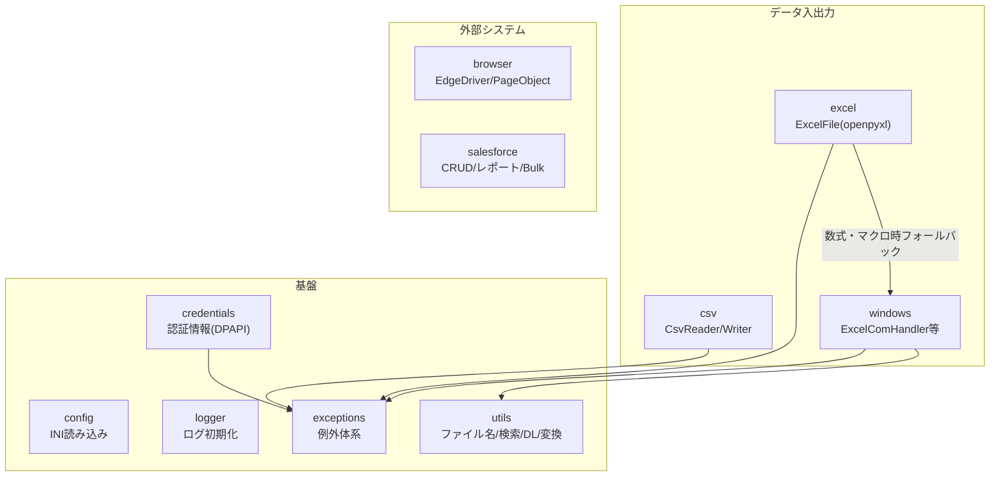

# comken 仕様書（エンジニア向け）

各モジュールの使い方（コード例）は [README.md](README.md)、コーディング規約は [CONVENTIONS.md](CONVENTIONS.md) を参照。
この文書はライブラリの設計方針・ユースケース・設計判断を記録する。

---

## 1. 概要と設計方針

社内業務自動化（Excel・CSV・ブラウザ・Salesforce・Windows 操作）の共通処理を集めたライブラリ。
マクロ（VBA）で行っていた業務の Python 移行を主な用途とする。

| 方針 | 内容 |
|---|---|
| 可読性最優先 | 短く賢いコードより、半年後に読めるコード。bool 引数よりメソッド名で意味を表す |
| 非エンジニア協業前提 | エラーメッセージに対処法を含める。設定は config.ini、認証情報は対話式ツールで登録 |
| オフライン環境で動く | 社内 BO 環境では pip が使えない。依存は最小限にし、標準ライブラリを優先 |
| 失敗は早く・明確に | ファイルなし・認証情報なしは即例外。握りつぶさない |
| YAGNI | 3箇所で同じ処理が出るまで共通化しない（今後絶対使うものは例外） |

---

## 2. 全体構成



| モジュール | 責務 | 依存 |
|---|---|---|
| `config` | config.ini を `config.SECTION.KEY`（大文字）で読む | 標準のみ |
| `logger` | 日別ファイル + コンソールのログ初期化 | 標準のみ |
| `exceptions` | 全例外の定義（`OriginalLibsError` 基底） | なし |
| `credentials` | 認証情報の DPAPI 暗号化保存・取得・管理 CLI | pywin32 |
| `utils` | ファイル名生成・ファイル検索・ダウンロード管理・データ変換 | 標準のみ |
| `csv` | CSV の読み書き・検索・索引化 | 標準のみ |
| `excel` | Excel 読み書き（openpyxl）。数式・マクロは windows へフォールバック | openpyxl |
| `windows` | Excel COM・ウィンドウ・レジストリ操作 | pywin32 |
| `browser` | Edge WebDriver・Page Object 基盤 | selenium |
| `salesforce` | CRUD・レポート・Bulk・REST | simple-salesforce, requests |

原則: **上のモジュールは下（基盤）に依存してよいが、基盤は業務モジュールに依存しない。**

---

## 3. ユースケース

| ID | 業務シナリオ | 使用モジュールの流れ |
|---|---|---|
| UC1 | NAS 上の当日 Excel を加工して出力 | `FileFinder.today` → `ExcelFile`（大容量は自動ローカルコピー）→ 加工 → `save` |
| UC2 | CSV を Excel 帳票へキー突合転記 | `CsvReader.index` → `ExcelComHandler.transfer_by_key` → `save_as`（PW付き） |
| UC3 | Web サイトからファイルを取得して処理 | `Credentials` → `EdgeDriver` + `SitePage` → `DownloadDir.wait` → `ExcelFile` / `CsvReader` |
| UC4 | Salesforce のデータを Excel 出力 | `Credentials` → `SalesforceReportClient.run` → `ExcelFile.write_cell` |
| UC5 | 既存 VBA マクロを段階的に移行 | `ExcelComHandler.run_macro`（マクロを残したまま前後処理を Python 化）|
| UC6 | 2つのデータの差分チェック | `CsvReader.rows` ×2 → `diff_rows` → 差分を Excel / ログ出力 |
| UC7 | 非エンジニアの初回セットアップ | `python -m comken.credentials` →「まとめて登録」（`REQUIRED_CREDENTIALS` 宣言を読む）|

---

## 4. 主要な設計判断

### 4.1 config.ini は非機密のみ・大文字

- config.ini は非エンジニアが触る前提。パスワード・個人情報は書かず credentials に分離
- セクション名・キー名は大文字で書き、Python 側の `config.SECTION.KEY` と表記を一致させる
  （`Config` は内部で `.upper()` するため、小文字の ini でも動くが表記のズレが混乱を生む）
- 自動変換するのは `true` / `false` の bool 変換のみ。yes / no / on / off / 1 / 0 や数値は
  文字列のまま返し、必要な変換は呼び出し側で行う（暗黙変換による事故を避ける）

### 4.2 ブラウザ設定は config.ini ではなくクラス変数

`DRIVER_PATH` / `WAIT_SECONDS` 等はプロジェクト固有ではなく環境共通のデフォルトであるため、
`BrowserOptions` のクラス変数として持ち、プロジェクトはサブクラスで差分だけ上書きする。

### 4.3 認証情報（credentials）

| 判断 | 理由 |
|---|---|
| Windows DPAPI（ユーザー × PC 紐付け） | 鍵管理が不要。ファイルを持ち出されても復号不可。1人1アカウント運用が前提 |
| 保存先は `%USERPROFILE%\.comken\credentials.dat` | プロジェクト外に置くことで commit 事故を防ぎ、全プロジェクトで共有できる |
| キー1つ＝値1つのフラット構造 | 「username と password が必ずセット」という決め打ちを避ける |
| キー名は `システム名_項目名`（半角英数字+_のみ） | config.ini・コードに書く値のため。違反は `InvalidCredentialNameError` |
| `Credentials(prefix)` の属性アクセス | キー名の直書き（マジックナンバー化）を防ぎ、config.ini のプレフィックス変更だけで本番/テストを一括切り替え |
| 必要キーは `REQUIRED_CREDENTIALS` としてコード側に宣言 | 「コードが何を使うか」はコードの事実。CLI が AST で読み（実行せず）、まとめて登録メニューを出す |

### 4.4 ExcelFile と ExcelComHandler の使い分け

- 通常の読み書きは `ExcelFile`（openpyxl。Excel 不要・高速）
- 数式の計算結果・VBA マクロ・パスワード付き保存が必要なときだけ `ExcelComHandler`（COM。Excel 必須）
- `ExcelFile` は必要時に内部で COM へ自動フォールバックする

### 4.5 見つからない・失敗はデフォルトで例外

`FileFinder.today/latest`、`load_credential` 等は見つからない場合に即例外
（業務スクリプトは「なければ止まって人に知らせる」が正解のため）。
続行したい場合のみ `required=False` を指定する。例外メッセージには対処法・登録コマンドを含める。

---

## 5. 例外体系

```
OriginalLibsError                 ← まとめて捕捉する場合はこれ
├── ExcelError
│   ├── SheetNotFoundError
│   └── MacroError
├── CsvError
├── ColumnNotFoundError
├── ConfigError
└── CredentialError
    ├── CredentialNotFoundError   ← 登録コマンドを案内するメッセージ付き
    └── InvalidCredentialNameError
```

方針:
- 素の `ValueError` / `Exception` は投げない（呼び出し側で判別できるようにする）
- メッセージは「何が・どこで・どうすればよいか」を含める（非エンジニアが読む前提）
- 行処理のエラーは行番号を含めて再送出する（`transfer_by_key` 等）

---

## 6. 動作環境・依存

| 項目 | 内容 |
|---|---|
| Python | 3.10 以上（`X \| None` 型ヒントを使用） |
| OS | Windows（credentials / windows / browser は Windows 専用） |
| 必須依存 | openpyxl, selenium, simple-salesforce, requests |
| オプション依存 | pywin32（credentials / windows モジュール使用時） |
| インストール | `pip install -e .`（オフライン環境では comken フォルダごと配布） |

---

## 7. テスト

- `tests/` に pytest。実行: `python -m pytest tests -q`
- 現在 91 件。config / csv / utils / credentials / logger / exceptions をカバー
- **未テスト領域**: Excel COM（`ExcelComHandler`）・Selenium（`browser`）・Salesforce API。
  これらは外部依存（Excel 本体・ブラウザ・SF 環境）が必要なため、実機での動作確認で担保する
- credentials のテストは DPAPI を実際に暗号化・復号する（モックしない）

---

## 8. 配布・運用

### 共有サーバー方式（常に最新を使わせる）

- 社内では comken を**共有サーバーの1箇所**に配置し、各 PC はそこを editable インストールで参照する

```
# 各 PC で1回だけ実行（以後、共有フォルダを更新すれば全員が即最新になる）
pip install -e \\server\share\tools\comken
```

- editable インストールは共有フォルダ内のコードを直接 import するため、
  **共有フォルダを差し替えるだけで全プロジェクト・全 PC が次回実行から最新版**になる。
  「自動更新の仕組み」を作る必要がない（更新という工程自体が存在しない）
- 更新手段: 自宅で開発 → GitHub 経由または USB 等で持ち込み → 共有フォルダを丸ごと差し替え

補足（editable 方式の注意点）:

| 事象 | 挙動・対処 |
|---|---|
| 実行中のプロセス | 読み込み済みのコードで動き続ける。反映は**次回起動から**（実行中に差し替えても安全） |
| 共有フォルダにアクセスできない | import 自体が失敗して起動できない。ネットワーク断が想定される環境なら、起動用 bat で `robocopy` 共有→ローカル同期してから実行する方式に切り替える |
| `__pycache__` | 共有フォルダに書き込めないユーザーがいてもエラーにはならない（キャッシュなしで動く）。気になる場合は起動 bat で `set PYTHONDONTWRITEBYTECODE=1` |

### 互換性ポリシー（共有サーバー方式の代償）

全プロジェクトが常に最新を参照する＝**古い comken に固定して逃げる手段がない**。
そのため公開 API の互換性は次のルールで守る。

| ルール | 内容 |
|---|---|
| 原則、名前は変えない | 公開 API（クラス名・メソッド名・引数名）の変更は最後の手段 |
| 変える場合、旧名は削除しない | 旧名は動き続ける。黙って壊すことはしない |
| 旧名には警告を付ける | `comken/deprecation.py` の `warn_renamed(旧名, 新名)` を使う |

警告の仕様:
- `FutureWarning` を使う（`DeprecationWarning` はデフォルト非表示のため気づけない）
- 文言は「動作しますが、○○に書き換えてください」（非エンジニアが見ても不安にならない表現）
- Python の警告機構により、**同じ箇所からは1回の実行につき1度しか表示されない**（スパムにはならない）
- 警告を出し続ける期間: 全プロジェクトの移行を確認できるまで＝実質無期限。
  ただし全プロジェクトの grep で旧名の不使用を確認できたら、旧名と警告を削除してよい

### その他

- 開発は自宅（このリポジトリ）、利用は社内 BO 環境（オフライン）
- 変更は master へ直接 commit & push（単独開発のため）
- プロジェクト側のドキュメント構成（使い方.md / 仕様書.md / ERRORS.md）は CONVENTIONS.md を参照
